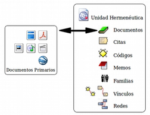
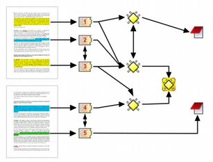

## ¿Qué es **ATLAS.ti**?

El ATLAS.ti se originó en la Universidad Tecnológica de Berlín, en el marco del proyecto ATLAS, entre 1989 y 1992. El nombre es un acrónimo de Archiv für Technik, Lebenswelt und Alltagssprache, que en alemán quiere decir 'Archivo para la Tecnología, el Mundo de la Vida y el Lenguaje Cotidiano'. La extensión '.ti' significa interpretación de textos. Se pueden encontrar mayores detalles sobre el origen del programa en el interesante relato de Heiner Legewie \(2014\). En 1996 fue lanzada la primera versión comercial y en 2012 apareció la versión 7. El lanzamiento de la versión 8 fue anunciado para finales de 2015.

A continuación describiremos algunas de las características principales de ATLAS.ti. En primer lugar haremos un repaso de los componentes principales del programa. En segundo lugar, presentaremos algunas de las operaciones básicas relacionadas con la documentación, la segmentación y codificación y el establecimiento de relaciones entre elementos

### Componentes

**Unidad Hermenéutica:** El trabajo de análisis con ATLAS.ti se organiza y almacena en un único archivo que se denomina _Unidad Hermenéutica_ \(UH a partir de ahora\). La extensión de una unidad hermenéutica —lo que identifica al fichero en el ordenador— es _\_.hpr7\* \(en la versión 7 del programa\). Para que quede claro, una unidad hermenéutica es al ATLAS.ti, lo que un libro de cálculo es al Excel.

La UH contiene toda la información producida en el transcurso de nuestro análisis. La información se organiza en diferentes objetos. Los objetos básicos, los 'componentes principales' del programa \(ver figura \ref{fig-componentes}\), son los _Documentos Primarios_ \(DPs a partir de ahora\), las _Citas_, los _Códigos_ y los _Memos_ \(anotaciones\). Junto a ellos, otros objetos importantes de la UH son las _Familias_, los _Vínculos_ \(relaciones entre objetos\) y las _Vistas de red_.

Los _**Documentos Primarios**_ serán normalmente la base de nuestro análisis, puesto que se corresponderán con nuestros datos \(entrevistas, observaciones, diarios de campo, documentos y registros de información de diversa índole\). Una UH puede incluir un gran número de DPs, tantos como datos se incluyan en nuestro análisis. En cuanto al formato de los datos que podemos utilizar, tenemos un amplio abanico de posibilidades. En primer lugar —lo más habitual— podemos tener archivos de texto con las transcripciones de las entrevistas, observaciones o cualquier otro tipo de material textual. Podemos incluir archivos de texto 'plano' o sin editar \(_\_.txt_\), documentos de Microsoft Word \(_\*.doc_\), documentos con formato de texto enriquecido \(_\*.rtf_\) —la opción más recomendable— e incluso documentos adobe \(_\*.pdf\).\* Podemos incluir también archivos multimedia como imágenes o fotografías, archivos de audio y archivos de vídeo. Y, finalmente, otra de las posibilidades es incluir como DPs archivos de Google Earth.

Las _**Citas**_ son fragmentos de los DPs que tienen algún significado, es decir, son segmentos significativos. Podemos entenderlos como una primera selección del material de base, una primera reducción de la información \(Patton, 1990\). Dependiendo de la naturaleza de los documentos primarios a segmentar, las citas pueden ser fragmentos de texto \(palabras, frases, enunciados, párrafos\), secciones rectangulares dentro de una imagen, lapsos en un archivo de audio o vídeo, o puntos en un mapa.

Los _**Códigos**_ suelen ser \(aunque no necesariamente\) la unidad básica de análisis. Habitualmente el análisis se basará en ellos. Podemos entenderlos como conceptualizaciones, resúmenes o agrupaciones de las Citas, lo que implicaría un segundo nivel de reducción de datos. Aun así, debemos tener en cuenta que no necesariamente tienen que estar relacionados con las Citas, es decir, los Códigos pueden utilizarse también como “conceptos” útiles para el análisis que no necesariamente tienen una relación directa con selecciones de texto, imagen, sonido, etc.

Aunque cada uno de los componentes anteriores puede tener asociado un comentario, podemos entender los _**Memos**_ como comentarios de un nivel cualitativamente superior, puesto que son todas aquellas anotaciones que realiza el analista durante el proceso de análisis. Podemos escribir memos analíticos en las que desarrollemos hipótesis sobre formas de codificación o relación entre códigos. Podemos elaborar memos procedimentales en los que describamos nuestro proceso de análisis de forma que podamos dar cuenta del mismo. Podemos incluso tener memos en los que se incluya todo aquel material que no forma parte de nuestros datos pero conviene tener fácilmente accesible \(e.g. los objetivos de la investigación, el guión de una entrevista o la estrategia de muestreo\). En los memos esperaríamos encontrar la redacción progresivamente refinada y organizada de los aspectos más significativos del proceso y los resultados del análisis.

Las _**Familias**_ son grupos de objetos. En el caso de los documentos primarios, los códigos y las anotaciones, podemos realizar agrupaciones en unidades que el programa denomina _familias_ y que incluirán aquellos elementos que para el analista presentan alguna característica común^\[No existen familias de citas, puesto que su equivalente serían los códigos.\]. Estas agrupaciones pueden ser útiles como forma de organización y como forma rápida y fácil de seleccionar y filtrar los componentes que cumplan unas determinadas características. En el caso de los códigos, la creación de familias puede ser un paso hacia el establecimiento de relaciones, la creación de códigos más abstractos y la elaboración de bloques de modelos teóricos.

Podemos establecer _**Vínculos**_ \(relaciones\) de diferentes tipos entre objetos como citas, códigos y memos: cita-código^\[Las relaciones entre citas y códigos es lo que normalmente conocemos por codificación.\], cita-memo, código-memo, cita-cita, código-código y memo-memo. En el caso de las relaciones cita-cita y código-código, vincular estos elementos significa crear una relación lógica entre ellos, relación que debe definir el analista y que podemos entender como una de los elementos importantes del análisis. Los elementos vinculados pueden representarse gráficamente y editarse en las vistas de red.

Las _**Vistas de red**_ son uno de los componentes más interesantes y característicos de ATLAS.ti, y uno de los elementos principales del trabajo conceptual. Permiten operar con información compleja de una forma intuitiva mediante representaciones gráficas de los diferentes componentes y de las relaciones que se hayan establecido entre ellos.

La figura \ref{fig-componentes-relaciones} ilustra los componentes principales del ATLAS.ti y las relaciones que pueden establecerse entre ellos. La presentación de los componentes y sus relaciones muestra la progresiva reducción de información, que es simultáneamente un proceso de interpretación y abstracción. El punto de partida son los documentos primarios, de los cuales se extraen citas que después se vinculan a códigos. Tanto las citas como los códigos pueden relacionarse entre ellos mismos. Además, es posible y frecuente incluir códigos que no están directamente asociados a citas, pero sí a otros códigos. Finalmente, podemos vincular memos con citas, códigos y otros memos.

