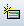
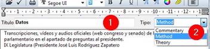
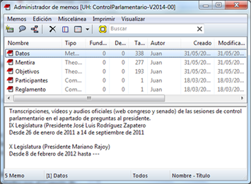
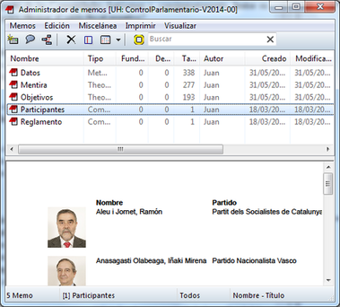

:icons: font

[[crear-memos]]
=== Crear Memos

Para la creación de __Memos__, podemos seleccionar la opción _Crear memo libre_ desde el menú _Memos_ o, desde ese mismo menú, abrir el _Administrador de memos_ y hacer clic en el icono de creación.

[TIP]
====
 Siempre que veamos este icono, podremos crear un nuevo elemento. Es decir, crearemos un Memo si lo visualizamos en el _Administrador de Memos_, crearemos un código en el _Administrador de códigos_ y así en cada caso.
====

Lo primero que tendremos que hacer, será dar un nombre a nuestro __Memo__, y a continuación (y aquí viene lo más complicado) escribirlo en el editor que nos aparecerá a continuación. En la figura <> podemos apreciar que ese editor se diferencia del que habíamos visto al crear el comentario de UH. En este caso tenemos (1) una zona en la que aparece la etiqueta con la que hemos nombrado el __Memo__, y (2) una lista
desplegable para seleccionar el tipo de __Memo__. Esta lista nos ofrece tres posibilidades, __Commentary__, _Method_ y __Theory__. Es decir, podemos clasificar nuestros _Memos_ en tres categorías
diferentes.footnote:[O más, puesto que es posible editar esta lista en `Preferencias > Preferencias generales` , pestaña Memos.] En este caso, a pesar de nuestra insistencia en la documentación y sistematización, nos sumamos a Saldaña (2009, p. 33) quien prefiere hablar únicamente de __memos analíticos__.

[[img-editor-memos, Editor de memos]]
.Editor de memos

En la figura anterior vemos un posible ejemplo de __Memo__. En este caso, hemos creado un _Memo_ _“Datos”_ en el que describiremos de una forma genérica los datos que incluiremos en nuestro análisis. Parece evidente también que, dado que cualquier análisis no tiene sentido sin unos objetivos, podemos tener un _Memo_ con la descripción de nuestros objetivos, de forma que los tengamos siempre “a mano” (sobre todo si el análisis lo realiza un equipo de analistas). En la figura siguiente podemos ver el administrador de __Memos__, en el que apreciamos una parte superior con la lista de _Memos_ y una parte inferior con el texto del _Memo_ seleccionado.

[[img-administrador-memos, Administrador de memos]]
.Administrador de memos

Dos de esos memos tienen una característica particular, puesto que son en realidad archivos PDF que se están utilizando como __Memos__. Por ejemplo, el _Memo_ “Reglamento” es un PDF con el reglamento del Congreso. No se trata de un documento que deseemos analizar, pero sí de un documento que es necesario conocer para poder entender mejor cómo transcurren las sesiones de control. Tenerlo como _Memo_ nos permite tener un acceso fácil al mismo, sin necesidad de tener que “buscarlo” cada vez que tengamos necesidad de consultarlo.

Un caso similar es el del _Memo_ “Participantes”, un PDF en el que hemos recogido todos los datos posibles sobre cada uno de los participantes en las sesiones de control. En la figura podemos ver cómo lo que se visualiza en la parte inferior del _administrador_ es parte del archivo PDF.

[[img-memo-con-pdf, Memo con archivo PDF]]
.Memo con archivo PDF

En síntesis, los memos, progresivamente elaborados, desarrollados, revisados y organizados en el curso del análisis contienen —o al menos deberían contener— los aspectos más significativos del análisis, tanto
en términos de resultados como de proceso. Más adelante (<<04-2-asignar-documentos-primarios.adoc#insercion-de-objetosficheros, Inserción de objetos/ficheros>>) explicamos con más detalle cómo utilizar esta funcionalidad.
