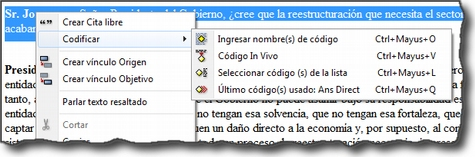

[[codificacion]]
=== Codificación

Podemos entender las estrategias de segmentación/codificación explicadas hasta el momento como formas “puras” de análisis deductivo o inductivo. En la práctica, lo que haremos habitualmente será realizar de forma simultánea ambas tareas, la de creación de citas y, al menos en los primeros momentos del análisis, la de creación y aplicación de códigos.

Como podemos ver en la figura <>, el menú contextual que aparece después de seleccionar un fragmento de texto y hacer clic sobre él con el botón derecho, nos ofrece varias opciones de codificación. Todas ellas implican que de forma simultánea se creará una cita, un código (si no existe previamente) y una relación entre la cita y el código.

[[img-opciones-codificacion, Opciones de codificación]]
.Opciones de codificación

La primera opción, _Ingresar nombre(s) de código_ abrirá una nueva ventana, como la que veíamos previamente al crear _códigos libres_ (ver figura <<05-1-creacion-de-codigos#codigos-libres, Creación códigos libres>>) en la que introduciremos los nombres de nuevos códigos y simultáneamente los relacionaremos con la cita. Si introdujésemos el nombre de un código exactamente igual a uno ya existente, ATLAS.ti no creará uno nuevo, sino que utilizará el que ya existe para codificar la cita.

La opción _Código In Vivo_ es una forma especial de creación de códigos en la que el nombre de código se corresponderá con el texto seleccionado. No es conveniente, por lo tanto, utilizar esta opción con fragmentos largos de texto (habitualmente se utiliza como selección sólo una palabra). La codificación _en vivo_ es algo más que una de las formas de codificación utilizadas por ATLAS.ti. Para saber más sobre ella, ver por ejemplo Strauss & Corbin, 2002.

La opción _Seleccionar código(s) de la lista_ visualizará una ventana con la lista de códigos creados previamente en la que podemos seleccionar uno o varios códigos para relacionar con la cita. En procesos de análisis con una lógica inductiva, esta opción se vuelve más recurrente en momentos posteriores del proceso de segmentación y codificación, cuando ya contamos con un buen número de códigos creados.

Finalmente, la opción _Último código(s) usado:_____________,_ que aparece completada con el nombre del último o últimos códigos aplicados a una cita, permitirá codificar el fragmento seleccionado con el último código que hayamos utilizado. Si en una sesión de trabajo todavía no se ha aplicado algún código, la opción aparece desactivada.
