[[relaciones]]
=== Relaciones

[[img-relaciones-componentes, Relaciones entre componentes]]
.Relaciones entre componentes
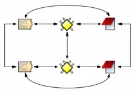

Aunque no hayamos hablado explícitamente de ello, hasta ahora hemos visto cómo podemos crear relaciones ente algunos objetos de la UH. Por una parte, la codificación implica relacionar _citas_ con __códigos__, mientras que la creación de _familias_ implica crear un tipo específico de vínculo entre objetos. En el caso de dos códigos incluidos en la misma familia, la relación se podría leer así: "el código A tiene en común alguna característica o propiedad con el código B". Si, por ejemplo, asignamos los códigos _Zapatero_ y _Rubalcaba_ a la familia __PSOE__, estamos diciendo que ambos comparten como propiedad su pertenencia al mismo partido político. De forma semejante, nuestro análisis podría implicar la creación de relaciones entre otros objetos. Para ello, ATLAS.ti nos permite relacionar entre sí citas, códigos y memos como se muestra en la tabla siguiente.

[[tab-tipos-relaciones, Tipos de relaciones]]
.Tipos de relaciones
[cols=",,,",options="header",]
|==========================================
| |Cita |Código |Memo
|Cita |Hypervínculo |Codificación |Relación
|Código | |Relación |Relación
|Memo | | |Relación
|==========================================

A diferencia del resto, las relaciones __cita-cita__, y las relaciones _código-código_ deben especificarse a partir de sus respectivos menús de tipos de relación. Establecer relaciones entre estos objetos significa crear un vínculo lógico que *debe* definir el analista. En muchos casos, esta labor constituye una de las etapas importantes del análisis conceptual. Una vez avanzado el trabajo de establecer vínculos, la red que conforma un conjunto de objetos relacionados se puede visualizar y editar en un entorno gráfico a través de las <<07-vistas.adoc#vistas-de-red, _Vistas de red_>>. Este recurso nos facilitará. por una parte, el trabajo conceptual al poder visualizar las relaciones ya creadas y crear nuevas de una forma gráfica, y por otra, nos permitirá ilustrar de una forma mucho más clara nuestro trabajo.

[[relaciones-entre-citas]]
==== Relaciones entre Citas

Las relaciones _cita-cita_ se denominan __Hipervínculos__, y podemos crearlas con la opción `Citas > Vincular` o con los iconos de la barra vertical. La creación de un hipervínculo entre citas implicará:

1) seleccionar una cita existente,

2) seleccionar la opción _Crear vínculo Origen,_

3) seleccionar una segunda cita, y

4) seleccionar la opción __Crear vínculo Objetivo__. +

Una vez definida la fuente y el destino, aparecerá un menú (figura <>, izquierda) en el que podremos +

5) elegir el tipo de relación que queremos definir entre la cita fuente de la relación (__origen__) y la cita destino de la relación (__objetivo__).

Finalmente, aparecerá un segundo menú (figura <>, derecha) que nos permitirá continuar estableciendo hipervínculos partiendo desde la cita definida como _origen_ (relación en estrella) o continuando desde la cita que habíamos definido previamente como _objetivo_ (relación en cadena).

[[img-definicion-hipervinculos, Definición de hipervínculos]]
.Definición de hipervínculos
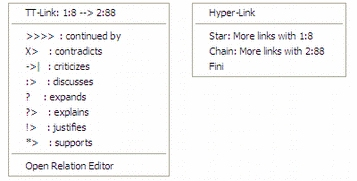

Como podemos ver en la figura <>, el tipo de estructura puede cambiar a medida que vamos definiendo nuevos __hipervínculos__. En este caso, se ha definido la cita 1 como _origen_ y la 2 como __objetivo__. Una vez creada la relación se ha elegido la opción __Cadena__, con lo que la cita 2 se ha convertido en _origen_ y hemos seleccionado la cita 3 como __objetivo__. A continuación hemos seleccionado la opción _Estrella_ y definido la cita 4 como __objetivo__. Al crear la relación y escoger de nuevo la opción __Estrella__, al elegir como _objetivo_ la cita 5 esta quedará relacionada con la cita 3, que seguirá siendo la cita __origen__.

[[img-estructura-hipervinculos, Estructura de hipervínculos]]
.Estructura de hipervínculos
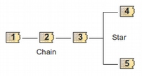

También podemos crear los hipervínculos desde el __administrador de citas__, arrastrando la cita _origen_ hasta la cita __objetivo__. Una de las situaciones en las que las relaciones _cita-cita_ son relevantes se encuentra en aquellas prácticas analíticas en las que resulta necesario el contraste entre las particularidades —aquello que se asume como no reductible a propiedades o rasgos a consignar mediante un código— de diferentes secciones de un corpus.

[[visualizacion]]
===== Visualización

Anteriormente hemos mencionado que al usar el listado desplegable o el administrador sabemos que una cita está relacionada con otra porque en esa etiqueta aparecen los símbolos `>` o `<` como indicadores de que la cita es fuente o destino de un hipervínculo.

También podemos visualizar los hipervínculos en el margen derecho de la pantalla principal, de la misma forma que visualizamos los códigos asociados a las citas del documento primario activo. Para que esto sea posible, tenemos que seleccionar la opción `Tipo de objeto > Hiper-vínculos` del menú contextual del margen derecho de la pantalla principal. Esto hará que el tipo de elementos visualizados, que por defecto incluye únicamente los códigos, se incremente y que podamos ver también los hipervínculos definidos para las citas.

[[img-menu-contextual-margen, Menú contextual margen derecho]]
.Menú contextual margen derecho
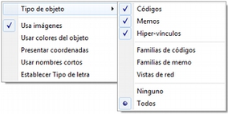

Si está seleccionada la opción __Usar imágenes__, la visualización será como la que aparece en la figura . Seguiremos viendo la barra vertical delimitadora de la cita y a su derecha información sobre las relaciones de esa cita, tanto con códigos como con otras citas.

[[img-visualizacion-hipervinculos, Visualización hipervínculos]]
.Visualización hipervínculos
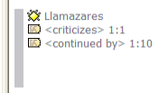

En el caso de los __hipervínculos__, la información que incluye consiste en:

1.  Un icono de cita (que variará en función del tipo de documento primario);
2.  el tipo de relación definida entre ambas; y
3.  la identificación de la cita relacionada (en la ilustración, las citas 1 y 10 del documento 1).

[[navegar]]
===== Navegar

Que ATLAS.ti utilice la etiqueta "hipervínculos" para referirse a las relaciones entre citas quiere decir que en la práctica estas relaciones, además de formar parte del análisis conceptual, pueden servir para _navegar_ por los documentos como si tuviéramos auténticos hipervínculos del tipo de los que aparecen en las páginas web. Es decir, podemos desplazarnos fácilmente desde una cita a otra siempre que hayamos definido una relación de cualquier tipo entre ellas.

En el caso de las relaciones entre dos citas de texto o entre una cita de texto y una de imagen, este desplazamiento puede ser "físico", es decir, que podemos pasar a ver en pantalla la cita __destino__. De esta forma, podremos "leer" de una forma diferente nuestros documentos como si se tratara de hipertextos. Si, por ejemplo, hemos definido una relación del tipo...

`Cita A ― critica > Cita B`

…podemos, después de leer la __Cita A__, desplazarnos a la _Cita B_ aunque ésta se encuentre en un documento diferente.

En la figura podemos ver un ejemplo de _hipervínculo_ entre documentos de texto. La etiqueta del _hipervínculo_ nos informa de que existe una relación del tipo `<continued by>` entre la cita seleccionada y la cita 10 del mismo documento.

[[img-desplazamiento-entre-hipervinculos, Desplazamiento entre hipervínculos]]
.Desplazamiento entre hipervínculos
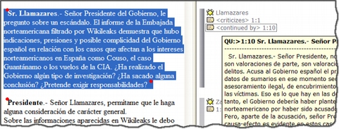

La información que podemos ver bajo la etiqueta aparece cuando seleccionamos la opción _Presentar Cita info_ en el menú contextual del _hipervínculo_ o **al hacer doble clic sobre la etiqueta**. Al tratarse de una cita de texto podemos ver, además de su etiqueta, la cita completa. Si queremos desplazarnos hasta ella bastará volver a hacer **clic, en esta ocasión sobre el recuadro con la información**. La información que aparece en el caso de otros tipos de citas (imagen, sonido o vídeo) queda reducida a la etiqueta de las citas. El desplazamiento desde una cita a otra se producirá únicamente en el caso de las relaciones entre citas de texto con otras citas de texto o imagen. En el caso de las citas de sonido o vídeo la información aparecerá únicamente si utilizamos el menú contextual, mientras que el doble clic sobre la etiqueta del hipervínculo hará que pasemos a oír o ver la cita seleccionada.

[[eliminar]]
===== Eliminar

El menú contextual que nos permitía acceder a la información sobre el __hipervínculo__, ofrece también la posibilidad de eliminarlo (__Desvincular__). Esta opción hay que utilizarla con cierta precaución puesto que no se nos pedirá confirmar la opción de borrado del __hipervínculo__. No existe opción para deshacer el borrado.

[[relaciones-entre-codigos]]
==== Relaciones entre Códigos

Las relaciones entre códigos siguen los mismos principios que las relaciones entre citas. La creación de estas relaciones está disponible mediante el menú `Códigos > Vincular código a:`.

[[img-menu-vincular-codigos, Menú vincular códigos]]
.Menú vincular códigos
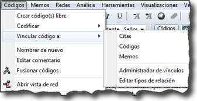

Al seleccionar esta opción se nos ofrecerán tres tipos posibles de vinculación: con citas, con códigos y con memos. La primera de ellas sería una nueva forma de codificación en la que, en este caso, nos aparecería una ventana con la lista de citas disponibles y podríamos seleccionar las que quisiéramos relacionar con el código seleccionado.footnote:[Este procedimiento sería similar al de codificación por lista, con la diferencia de que en un caso nos aparece una lista de códigos para relacionar con la cita seleccionada y en otro una lista de citas para relacionar con el código seleccionado.] Por lo que respecta a las relaciones con los memos, las desarrollaremos en el siguiente apartado. Para definir las relaciones entre códigos seguiremos un procedimiento similar al de la definición de __hiperlinks__:

1. seleccionar el código que queremos definir como origen de la relación,

2. seleccionar en el menú la opción `Vincular código a: > Códigos`,

3. escoger el/los códigos _destino_ de entre la lista de códigos que aparecerán en una ventana, y

4. seleccionar el tipo de relación que deseamos.

Como vemos en la figura <>, otra diferencia con respecto a los _hiperlinks_ es en cuanto a los tipos de relaciones definidas por defecto. Como en el caso de los hiperlinks, podemos optar por añadir nuevas relaciones que se ajusten más a nuestras necesidades o modificar las características de alguno de los tipos existentes (ver <<editar-relaciones>>).

[[img-tipos-relaciones-codigos, Tipos de relaciones entre códigos]]
.Tipos de relaciones entre códigos
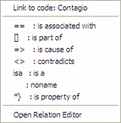

[[como-funcionan]]
===== Cómo funcionan

Como comentábamos anteriormente, de la misma forma que podemos considerar a las familias como una forma de agrupación del tipo “A _es un_ X”, (donde _**A**_ puede ser un código, un documento o una anotación y _**X**_ una categoría genérica), otra estrategia de agrupación, en el caso de los códigos, sería utilizar la relación _is a_ para vincular códigos que hacen referencia a conceptos de carácter específico con otro código, que puede ser un código libre, más general o abstracto. Aunque ATLAS.ti no ofrece la posibilidad de crear jerarquías de códigos a partir de la definición de niveles como propiedad adscrita a los propios códigos, podemos construir organizaciones jerárquicas a partir del establecimiento de relaciones asimétricas entre códigos. Por ejemplo, si anteriormente hemos creado una familia de códigos _Evasion_ para agrupar los códigos que hacen referencia a los diferentes niveles de evasión, otra posible estrategia sería la de crear un nuevo código (insistimos, nuevo código, no una familia) _Evasion_ con el que, usando el conector _es un,_ podemos relacionar los códigos __EvFul__, __EvMedium__, _EvSubstantial_ y __EvSubtil__, utilizando el tipo de relación __is a__.

Podemos, por lo tanto, utilizar dos estrategias diferentes para “agrupar” códigos, mediante la creación de familias o mediante la creación de relaciones entre códigos. Ante la pregunta sobre cuál de las dos estrategias es recomendable, la respuesta es que ambas, puesto que nada impide que tengamos tanto la familia de códigos _Evasion_ como el código _Evasion_ (con sus relaciones). La diferencia básica entre estas estrategias consiste en que en la segunda, al disponer de un código _Evasion_ podríamos establecer nuevas relaciones entre este código y otros, algo que no podemos hacer en el caso de las familias, puesto que **no se pueden establecer relaciones entre familias y otros componentes**.

Una forma de constatar que las estrategias no son excluyentes es que el programa nos ofrece la posibilidad de crear relaciones entre códigos a partir de una familia existente (sólo para el tipo de relación “is a”). Una vez creada una familia de códigos, hay que acceder al _administrador_ de familias de códigos y hacer clic con el botón derecho del ratón sobre el nombre de la familia con la que queramos trabajar. En el menú contextual que nos aparecerá, seleccionaremos la opción __Crear red__. Nos aparecerá entonces una ventana en la que se nos informará de la creación de un nuevo código con el mismo nombre que la familia, al que estarán vinculados los códigos que forman parte de la familia.

[[img-relaciones-desde-familias, Crear relaciones desde familia]]
.Crear relaciones desde familia
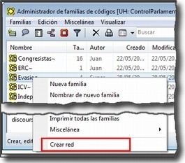

Hasta el momento, hemos podido visualizar en el margen derecho todos los elementos que hemos ido creando, algo que no es posible con las relaciones entre códigos. El único cambio apreciable lo encontramos en el __administrador de códigos__. En la columna _Densidad,_ nos informará del número de relaciones de cada código con otros códigos. En este caso, el código _Evasion_ tendrá una _densidad_ de 4, al estar relacionado con los códigos referentes a las cuatro modalidades de evasión, mientras que los códigos relativos a las modalidades tendrían cada uno una _densidad_ de 1.

El modelo con el que hemos venido trabajando Rasiah (2010) es más complejo de lo expuesto hasta el momento, puesto que realiza una categorización del tipo de respuestas de las que la _evasión_ es sólo una de ellas. Podríamos por lo tanto reproducir el conjunto del modelo (figura <>) mediante el establecimiento de nuevas relaciones. Al mismo nivel que la rama _Evasion_ encontramos _Answer_ e __Intermediate Response__, así que procederemos a crear los códigos correspondientes. Además, en el caso de _Answer_ existen dos niveles, _Direct_ e _Indirect,_ por lo que crearemos también los códigos _Ans Direct_ y _Ans Indirect_ y volveremos a crear relaciones del tipo _is a_ entre _Answer_ y estos últimos códigos.

[[img-marco-analitico-evasion, Marco analítico para el estudio de la evasión (Rasiah, 2010, p. 667)]]
.Marco analítico para el estudio de la evasión (Rasiah, 2010, p. 667)
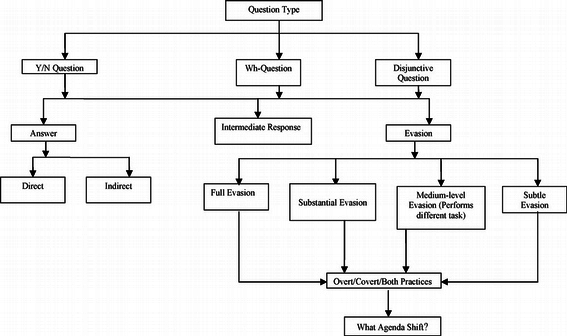

El siguiente nivel del modelo diferencia tres tipos de preguntas, las de tipo Sí/no, las de tipo Wh (cuándo, cómo, porqué) y las de tipo disyuntivo. Una vez creados los códigos (__Q Y/N, Q Wh__ y __Q Disjunctive__) correspondientes, volvemos a crear relaciones, aunque en este caso seleccionaremos el tipo de relación __is cause of__, es decir, crearemos la relación _Answer_ __is cause of Q Y/N__; __Answer is cause of Q Wh__, y así sucesivamente.

Para finalizar, volveremos a crear relaciones del tipo _Is a_ entre los últimos códigos creados y el nuevo código __Question Type__.

Podemos visualizar de nuevo el resultado del conjunto de relaciones seleccionando el código _Question Type_ y utilizando la herramienta `Códigos > Miscelánea >Árbol de códigos` (figura ).

[[img-arbol-codigos, Árbol de códigos]]
.Árbol de códigos
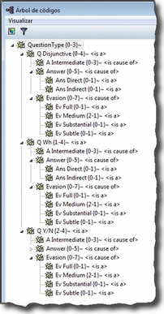

[[relaciones-con-memos]]
==== Relaciones con Memos

Los _Memos_ son el último de los objetos con el que podemos crear relaciones. Los _memos_ pueden relacionarse con citas, con códigos y con otros memos. Para la creación de las relaciones basta con seleccionar un memo, hacer clic con el botón derecho y en el menú contextual seleccionar la opción _Vincular memo a:_ y escoger el tipo de elemento con el que la queremos relacionar. Esta opción también está disponible desde el menú _Memos._ Igual que en los casos anteriores aparecerá una ventana con una lista de objetos en la que podremos seleccionar aquel o aquellos con los que queremos establecer la relación (derecha de la figura).

[[img-vincular-memos, Vincular Memos]]
.Vincular Memos
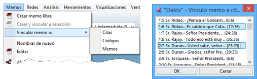

Mientras que al establecer relaciones entre citas (__hipervínculos__) o entre códigos el paso siguiente era definir el tipo de relación, esto no es posible en el caso de las anotaciones. Dicho de otro modo se trata de relaciones genéricas, cuyo tipo o naturaleza no puede especificarse como información asociada al vínculo. De cualquier modo, siempre es posible decir algo acerca de las relaciones en el contenido del propio _Memo_ si así fuera necesario.

[[editar-relaciones]]
==== Editar relaciones

Como hemos visto, en el momento de escoger el tipo de relación (tanto entre citas como entre códigos), una de las opciones que se nos ofrece es acceder al __editor de relaciones__, es decir, abrir una ventana de edición en la que podremos modificar las características de las relaciones existentes y crear nuevos tipos de relaciones que se ajusten a nuestras necesidades. También podemos acceder a la opción de edición de las relaciones, tanto entre citas como entre códigos, desde el menú `Redes > Editar relaciones`.

En la ventana _Editor de relaciones_ (figura <>), encontramos (1) una lista de los tipos de relaciones definidos y (2 a 5) sus características. La mayoría de las características afectan a la forma en que se presentará la relación en las redes). En (2) podemos cambiar, junto al identificador de la relación, las etiquetas de la relación, que son desplegadas en el menú de selección de tipos de relación y en las vistas de red, así como el texto que aparecerá en la barra de estado de las redes al seleccionar una relación. También podemos (3) cambiar características de la línea que representa la relación, como su color, grosor o tipo de trazo, (4) la dirección en que se representará por defecto la relación en las representaciones gráficas y (5) la propiedad formal del tipo de relación, que puede ser simétrica, asimétrica o transitiva. En el caso de las relaciones entre códigos es importante ser cauteloso con la propiedad formal que se defina para cada tipo de relación, puesto que puede afectar a los resultados que obtengamos al utilizar una de las herramientas más potentes de Atlas, la <<08-4-herramienta-de-consulta#herramienta-de-consulta, _Herramienta de consulta_>>. También es posible añadir o editar un comentario para la relación (6).

[[img-editor-relaciones, Editor de relaciones]]
.Editor de relaciones
image::images/image-109.png[{alt="Editor de relaciones", float="right", align="center"]

Si en vez de modificar las relaciones existentes queremos crear alguna nueva, tendremos que utilizar la opción `Edición > Nueva Relación`, y definir cada uno de los parámetros anteriores.

Una de las modificaciones que podemos realizar a las relaciones definidas por defecto, puede ser la de la etiqueta de representación en las _redes_ (__Etiqueta 1__, _Etiqueta 2_ y __Texto del menú__). Como hemos visto anteriormente, los símbolos definidos por defecto no son excesivamente ilustrativos del tipo de relación que representan. Este inconveniente puede solventarse, cuando estamos trabajando en una __Red__, por la información adicional que se ofrece en la barra de estado; sin embargo, si la imprimimos como una forma de ilustrar nuestro análisis, será difícil para los lectores interpretar el significado de símbolos como `->|` (critica), `:>` (discute), etc. Sugerimos, por lo tanto, modificar esos símbolos por etiquetas realmente ilustrativas como "critica", "discute", etc. Además, podemos aprovechar la posibilidad que nos ofrece el programa de intercambiar (en las __Redes__) entre la presentación de _Etiqueta 1,_ _Etiqueta 2_ y __Texto del menú__, lo que nos permitiría, por ejemplo, definir cada una de las etiqueta en diferentes idiomas y utilizar posteriormente uno u otro conjunto en función de las necesidades. En las tablas siguientes presentamos una propuesta de estructuración de las etiquetas para _hipervínculos_ y para __códigos__, respectivamente.

[[tab-etiquetas-hipervinculos, Etiquetas de hipervínculos]]
.Etiquetas de hipervínculos
[cols=",,,",options="header",]
|============================================
|ID |Etiqueta 1 |Etiqueta 2 |Etiqueta de menú
|CONTINUE |Continuada por |cont |continued by
|CONTRA |Contradice |CO |contradicts
|CRIT |Critica |crit |criticizes
|DISC |Discute |disc |discuss
|EXPANDS |Expande |?? |expands
|EXPL |Explica |expl |explains
|JUST |Justifica |just |justifies
|SUPP |Apoya |supp |supports
|============================================

[[tab-etiquetas-relaciones-codigos, Etiquetas de relaciones entre códigos]]
.Etiquetas de relaciones entre códigos
[cols=",,,",options="header",]
|============================================
|ID |Etiqueta 1 |Etiqueta 2 |Etiqueta de menú
|ASSO |Asociado |R |is associated with
|BTP |Es parte de |G |is part of
|CAUSA |Es causa de |N |is cuase of
|CONTRA |Contradice |A |contradicts
|ISA |Es un |O |is a
|NONAME | | |noname
|PROP |Es propiedad de |P |is property of
|============================================

Cada vez que realicemos una modificación a alguna de las relaciones existentes, el programa pedirá confirmación de si queremos conservar los cambios. Sin embargo, hay que tener presente que dichos cambios afectarán única y exclusivamente a la UH activa, es decir, que no estarán accesibles para otras UHs a no ser que previamente los guardemos en un fichero externo a la Unidad Hermenéutica. Para ello, en el editor de relaciones utilizaremos la opción `Archivo > Guardar relaciones`.

En el caso de las relaciones entre citas, el programa nos sugerirá guardar los cambios con el nombre de archivo __default.hyp__, mientras que en el caso de las relaciones entre códigos el nombre de archivo sugerido será __default.rel__. En ambos casos la ruta en la que se sugiere guardar los archivos es la siguiente:

`...\usuario\Datos de programa\Scientific Software\ATLASti\`

Por supuesto es posible dar un nombre y una dirección de archivo diferentes. En ese caso, cuando quisiéramos utilizar la lista de relaciones definida en ese archivo tendríamos, previamente que activarla con la opción `Archivo > Cargar relaciones`, desde la misma ventana de edición de relaciones.

[[administrador-de-relaciones]]
==== Administrador de relaciones

Hemos señalado que una de las formas de visualizar las relaciones entre códigos es mediante la herramienta _Árbol de códigos_ pero no disponemos de una herramienta similar para la visualización de los hipervínculos. Aún así, podemos visualizar en conjunto los hipervínculos y las relaciones entre códigos que hemos creado con los administradores de relaciones: _Administrador de hipervínculos_ y __Administrador de vínculos de códigos__. Podemos acceder a ambos desde el menú _Redes._ Esta opción no existe para las relaciones entre anotaciones y otros elementos.

En ambos casos se abrirá una ventana que permitirá una cómoda visualización de las relaciones definidas en nuestra UH. Como podemos observar, entre la información que nos muestra podemos ver el código fuente, el tipo de relación, y el código destino. Mediante la barra de menús (__Vínculos códigos__) o mediante el menú contextual, podemos acceder a algunas opciones de edición de la relación, como por ejemplo cambiar la dirección de la misma (__Voltear vínculo)__ o incluso cambiar el tipo de relación (__Cambiar relación__).

[[img-administrador-relaciones, Administrador de relaciones]]
.Administrador de relaciones
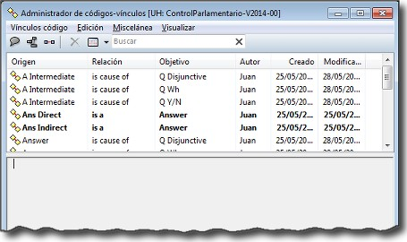

[[atajos-de-creacion-de-relaciones]]
==== Atajos de creación de relaciones

Además de la “mecánica” de creación que hemos explicado, existen otras formas de crear las relaciones que quizás puedan ser más rápidas o cómodas para algunas personas. Por ejemplo, podemos crear hipervínculos desde el _administrador de citas_ seleccionando una cita y arrastrándola hasta otra. Este mismo sistema de arrastre podemos utilizarlo para arrastrar, en el margen derecho de la pantalla, la barra identificadora de cita hasta otra barra identificadora. Evidentemente ambos sistemas serán prácticos cuando las citas que queremos relacionar estén cercanas. Si no lo están, otra forma de relacionar arrastrando es seleccionando una cita en el administrador de citas y arrastrándola hasta la barra identificadora del margen derecho (o viceversa). En el caso de los códigos también podemos relacionarlos entre sí arrastrando un código sobre otro en el __administrador de códigos__.

Otra de las formas que pueden ser prácticas consiste en utilizar los _navegadores de elementos_ que podemos activar en el margen izquierdo de la pantalla principal. Recordemos que los navegadores del margen izquierdo permiten visualizar los objetos principales de la UH: DPs, citas, códigos, memos y vistas de red. En la figura <> ofrecemos un ejemplo de su utilización, en el que se está arrastrando un código desde el _navegador_ del margen izquierdo hasta el __administrador de códigos__. Por supuesto se pueden utilizar otras combinaciones, pero esas tendrás que encontrarlas en el uso.

[[img-relacionar-arrastrando, Relacionar arrastrando]]
.Relacionar arrastrando
image::images/image-111.png[{alt="Relacionar arrastrando", float="right", align="center"]
