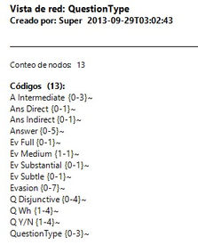

[[guardar]]
=== Guardar

Una vez creada__,__ podemos guardar la _red_ utilizando la opción `Red > Guardar o Red > Guardar como`. En este último caso, o si se trata de una nueva red, se nos pedirá un nombre.

De la misma forma que hemos comentado en ocasiones anteriores, la etiqueta de la red debe ser descriptiva del contenido, pero no es necesario (ni conveniente) que sea excesivamente larga. Una vez más, la descripción amplia del contenido, junto con cualquier otra información que consideremos necesaria, podemos incluirla en un _comentario_ utilizando la opción `Red > Editar Comentario`.

Es importante tener en cuenta que al crear una _red_ hemos hecho un cambio en la UH, y por lo tanto *también* será necesario guardar los cambios en la misma, pues en caso contrario la red desaparecerá.

Esta forma de guardar la __red__, como parte de la UH, evidentemente es necesaria para no perder nuestro trabajo, pero tenemos además la posibilidad de guardarla de forma externa como archivo gráfico, lo que posteriormente nos permitiría incluir la _red_ en un informe para ilustrar de una forma gráfica nuestro trabajo conceptual. Utilizaremos para ello la opción de menú `Red > Guardar como archivo gráfico`.

Aunque no sea excesivamente recomendable, otra forma de incluir una _red_ en un informe consiste en utilizar la opción `Red > Copiar al portapapeles`. Evidentemente, en ese caso lo que tendremos que hacer posteriormente es acceder al programa en el que queremos incluir la _red_ y seleccionar la opción __pegar__. Si nuestro informe lo estamos realizando (como es lógico) con un programa de procesador de textos, puede que nos “asustemos” al comprobar que el resultado de _pegar_ es una representación textual de la _red_ como la que aparece en la figura.

[[img-img-representacion-textual-red, Representación textual red]]
.Representación textual red

Para insertar la _red_ tal y como la vemos en ATLAS.ti, tendremos que utilizar la opción _Pegado especial_ (o el equivalente según el programa de edición que estemos utilizando) y elegir, entre los formatos que se proponen, alguno gráfico, como por ejemplo __Mapa de bits independiente del dispositivo__.
