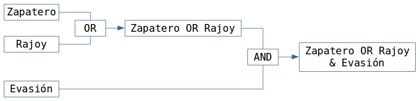
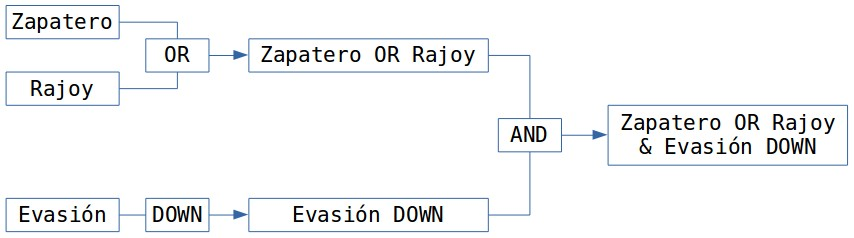
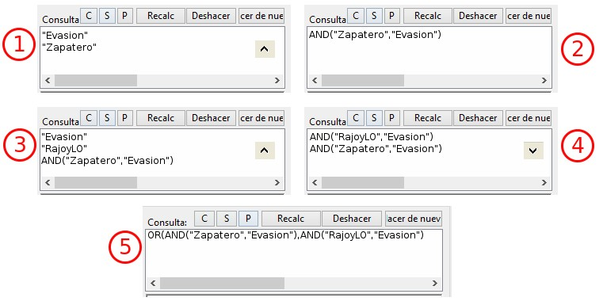
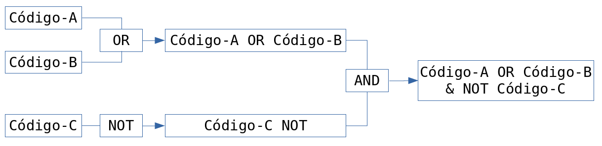

[[herramienta-de-consulta]]
=== Herramienta de consulta

Desde nuestro punto de vista, la herramienta más potente del programa es la __Herramienta de consulta__, la herramienta que nos permite realizar consultas sofisticadas de nuestros datos, que nos permite interrogar a nuestros datos para que nos muestre las citas que cumplen determinadas condiciones. Por lo tanto, con la _Consulta_ lo que obtendremos siempre será única y exclusivamente citas. Más concretamente las **citas que cumplen la condición de estar codificadas de una forma determinada**, lo que implica que esta herramienta está directamente relacionada con nuestro sistema de codificación y por lo tanto con el trabajo previo del analista. La _Consulta_ no nos ofrecerá ningún resultado, ninguna cita, que no haya sido previamente codificada.

Una posible consulta podría ser algo del tipo: “muéstrame todas las citas que están codificadas como... y al mismo tiempo como... O “muéstrame todas las citas que están codificadas como... pero no como...”.

En el apartado dedicado a la autocodificación (pág. 78) vimos cómo habíamos codificado las intervenciones de cada uno de los participantes y que posteriormente habíamos creado familias en las que agrupábamos a los participantes en función de su adscripción política. Tenemos por lo tanto una serie de códigos que podremos utilizar para realizar consultas en las que veamos las posibles diferencias en el discurso en función del partido político.

Nos podría interesar, por ejemplo, comparar las características de las respuestas evasivas del presidente Zapatero y del presidente Rajoy. Puesto que tenemos los códigos __Zapatero__, _RajoyPR_ y __Evasión__, podríamos realizar una consulta para solicitar las “citas codificadas como _Evasión_ y al mismo tiempo como __Zapatero__” y otra para solicitar las “citas codificadas como _Evasión_ y al mismo tiempo como __RajoyPR__”. Una vez que tenemos los resultados de ambas consultas (podríamos generar un informe impreso de cada una de ellas), podemos proceder a comparar las posibles similitudes y/o diferencias de ambos discursos.

Las consultas nos permitirán por lo tanto un nuevo nivel de análisis de nuestros datos y serán, entre otras cosas, una importante ayuda en nuestra tarea de “comparación constante”.

Una consulta consistirá siempre en la combinación de uno o más _operandos_ con un __operador__, donde los operandos son los códigos y familias de códigos y los operadores las condiciones que deben cumplirse para obtener un resultado. En el ejemplo anterior, para identificar las citas codificadas como _Zapatero_ y al mismo tiempo _Evasion,_ los operandos serían “Zapatero” y “Evasión” y el operador la condición Y.

[[la-pantalla-de-consulta]]
==== La pantalla de Consulta

Podemos acceder a la _Herramienta de consulta_ utilizando el icono “Prismático” de la barra de herramientas vertical o desde el menú `Análisis > Herramienta de consulta`. A continuación analizaremos la compleja ventana que nos aparece ( figura ).

[[img-herramienta-consulta, Herramienta de consulta]]
.Herramienta de consulta
image::images/image-141.png[{alt="Herramienta de consulta", float="right", align="center"]

\1) Códigos y Familias de Códigosfootnote:[En el resto de esta sección nos referiremos a ellos como __operandos__.] existentes en la UH. Como decíamos, son los _Operandos_ que utilizaremos en la definición de la __consulta__. La activación de los operandos para su inclusión en la consulta se realiza haciendo clic dos veces sobre ellos,footnote:[Para la definición de la consulta no necesitamos escribir nada, todo el trabajo lo realizaremos haciendo clic sobre operandos y operadores.] lo que hará que en la ventana de resultados (5) aparezcan las citas relacionadas. Aunque en principio una consulta tiene que incluir operandos y operadores, simplemente seleccionando un operando veremos sus citas (si las tiene) en la zona de resultados. A medida que vayamos añadiendo más operandos y operadores, la zona de resultados cambiará para reflejar los cambios.

\2) Condiciones a utilizar como operadores. Están agrupadas en tres categorías: Operadores __booleanos__, operadores _semánticos_ y operadores de __proximidad__. De nuevo, para seleccionar un operador sólo tenemos que hacer clic sobre el icono correspondiente.

\3) Conjunto de las expresiones formuladas, es decir, conjunto de combinaciones de operandos y operadores. Cada línea visualizada en esta zona genera un resultado. Como podemos ver ( Ilustración), hemos realizado dos consultas, la primera para citas que cumplan la condición de estar codificadas como Zapatero Y Evasión, y la segunda para las codificadas como RajoyLO Y Evasión.

\4) Esta zona es similar a la anterior, pero utiliza una _sintaxis_ diferente para visualizar las condiciones utilizadas. Como podemos ver, lo que se nos muestra es la última consulta realizada. Si en el paso anterior, tras las consultas ya realizadas hubiéramos clicado en el operador O, se nos mostraría el resultado de esa consulta:

\5) Resultados, citas que cumplen las condiciones de la última _consulta_ definida (la que se visualiza en (3)).

\6) Posibilidad de seleccionar (para los operadores de distancia) la distancia máxima que debe separar a dos citas (y el tipo de unidad de media: párrafos...) para que sean incluidas en los resultados.

\7) Acceso a una nueva ventana (__Alcance de consulta__, ver figura ) para seleccionar los documentos a los que se aplicará la consulta_._ En este caso los operandos serán documentos y familias de documentos y los operadores sólo los booleanos.

[[img-herramienta-consulta-alcance, Herramienta de consulta: Alcance]]
.Herramienta de consulta: Alcance
image::images/image-142.png[{alt="Herramienta de consulta: Alcance", float="right", align="center"]

\8) Convierte los resultados de la _consulta_ en una _Super-código_ (ver pág. 162).

\9) Conjunto de iconos que permiten eliminar una cita de la lista de resultados (no se borra la cita, sólo se la hace desaparecer de esta lista) o imprimir la lista de resultados.

\10) Opciones de edición de las expresiones

C = Borra todas las expresiones introducidas previamente.

S = Invierte el orden de los dos últimos operandos.

P = Duplica el último operando introducido.

Recalc = Vuelve a calcular la _consulta_ después de hacer cambios en la selección de documentos (7 en la ilustración anterior) o en la distancia (6 en la ilustración anterior).

Deshacer = Deshace la última acción.

Hacer de nuevo = Rehace la última acción.

[[sintaxis]]
==== Sintaxis

Probablemente una dificultad con la que nos encontraremos al crear la consulta tenga que ver con el hecho de que su definición se realiza utilizando la __Notación Polaca Inversa__.

[quote, Notación polaca inversa, 2015"]
____
“La __Notación Polaca Inversa__, notación de postfijo, o notación posfija, (en inglés, __Reverse polish notation__, o RPN), es un método algebraico alternativo de introducción de datos. Su nombre viene por analogía con la relacionada notación polaca, una notación de prefijo introducida en 1920 por el matemático polaco Jan Lukasiewicz, en donde cada operador está antes de sus operandos. En la notación polaca inversa es al revés, primero están los operandos y después viene el operador que va a realizar los cálculos sobre ellos. Tanto la notación polaca como la notación polaca inversa no necesitan usar paréntesis para indicar el orden de las operaciones mientras la aridad del operador sea fija.”
____

Esto significa que, si habitualmente una suma la escribiríamos 4 + 5, donde 4 y 5 son los operandos y el signo + es el operador, al utilizar la RPN tenemos que escribir en primer lugar los operandos y a continuación el operador, es decir, 4 5 +.

Volviendo a nuesto ejemplo, en vez de Zapatero Y Evasion, tendríamos que escribir Zapatero Evasion AND.footnote:[Como comentábamos, en esta herramienta no escribimos, sino que clicamos, por lo que cuando en este apartado hagamos referencia a “escribir”, el significado real es realizar diversas combinaciones de clics sobre operandos y operadores.]

En el caso de que quisiéramos obtener como resultado todas las citas del código _Evasion_ en las intervenciones de cualquiera de los presidentes (Zapatero o Rajoy) tendríamos que añadir alguna condición más a nuestra consulta. Tendríamos que realizar una consulta para obtener las citas de cada uno de los presidentes y posteriormente combinar los resultados con una condición O. Para ello, con una “sintaxis clásica” habríamos utilizado paréntesis para definir la prioridad de las operaciones. Pero como veíamos en la cita anterior, otra de las características de la RPN es que no utiliza paréntesis, por lo que tendríamos que formular la consulta de la siguiente forma:

\(1) Zapatero RajoyLO OR

\(2) Evasion

\(3) AND

Aunque la formulación pueda parecer extraña, en la práctica es relativamente sencilla si tenemos en cuenta que cada vez que obtenemos un resultado en una consulta ese resultado pasa a convertirse en un operando. Es decir, una vez que hemos obtenido las citas correspondientes a la primera parte de la consulta (1) éstas se convierten en un operando, lo mismo que las de (2), por lo que una vez que tenemos dos operandos los combinamos con el operador OR en (3).

[[img-esquema-consulta-a, Esquema consulta (a)]]
.Esquema consulta (a)

[[img-esquema-consulta-b, Esquema consulta (b)]]
.Esquema consulta (b)

También nos puede ayudar tener en cuenta que cuando escribimos la consulta en el programa, cada una de las líneas que aparecen en la zona 3 de la Ilustración es un operando, por lo que una consulta implicará combinar dos líneas (operandos) con un operador.footnote:[Aunque esto no es exactamente así, puesto que no todas las consultas requieren de dos operandos.] En la Ilustración podemos ver el proceso de escritura. En (1) hemos introducido los dos primeros operandos (códigos), que hemos combinado con el operador AND. En (2) tendríamos por lo tanto el resultado de la consulta, que a su vez será un operando. En (3) hemos vuelto a introducir dos operandos (códigos) que de nuevo hemos combinado con el operador AND (que afecta sólo a las dos primeras líneas que vemos en la ilustración), por lo que tenemos (en 4) el resultado de esa consulta en la primera línea, y el resultado de la anterior en la segunda. Al combinar ambos operandos con el operador OR, nos dará el resultado que podemos ver (5), es decir, “Todas las intervenciones del presidente Zapatero o del líder de la oposición Rajoy, que han sido codificadas como __Evasion__”.

[[img-consulta-secuencia-escritura, Consulta: Secuencia de escritura]]
.Consulta: Secuencia de escritura

[[operadores]]
==== Operadores

Para ilustrar la sintaxis de la _Consulta_ hemos utilizado los operadores AND y OR, que junto a XOR y NOT forman parte de la categoría de operadores booleanos. Junto a estos, disponemos de otros dos conjuntos de operadores, los semánticos y los de proximidad. A continuación procederemos a explicar las características de cada uno de ellos.

[[operadores-booleanos]]
===== Operadores booleanos

En la tabla podemos ver la descripción de los operadores booleanos.

[[tab-operadores-booleanos, Operadores booleanos]]
.Operadores booleanos
[width="16%",cols="34%,33%,33%",options="header",]
|=======================================================================
|Operador |Sintaxis |Función
|OR |_A B_ OR |Selecciona las citas presentes en el operando A o en el
operando B footnote:[En esta explicación “citas presentes en el
operando...” significa “citas codificadas con el código o familia de
códigos...”]

|XOR |_A B_ XOR |Selecciona las citas presentes únicamente en A o en B
(Y no las citas comunes a A y B)

|AND |_A B_ AND |Selecciona las citas presentes en A y en B

|NOT |NOT _A_ |Selecciona las citas no presentes en A
|=======================================================================

A continuación utilizaremos diagramas de Venn para ilustrar gráficamente los resultados de cada uno de los operadores. En los diagramas, cada uno de los conjuntos (círculos) equivaldría a un operando (código o familia de códigos), y las zonas sombreadas serán el equivalente al resultado obtenido, es decir, a las citas que serían recuperadas. En la figura tenemos el primer ejemplo con los operadores booleanos.

[[img-diagrama-venn-booleanos, Diagrama de Venn: Operadores Booleanos]]
.Diagrama de Venn: Operadores Booleanos
image::images/image-144.png[{alt="Diagrama de Venn: Operadores Booleanos", float="right", align="center"]

En (1) tenemos el resultado de la aplicación del operador OR, que implica la selección de todas las citas que están codificadas como A o codificadas como B. Por lo tanto se trata de un operador inclusivo, El operador XOR (O exclusivo) seleccionar igualmente las citas que están codificadas como A o como B pero no aquellas que están codificadas como A y al mismo tiempo como B, por lo que quedarían fuera las de la intersección de ambos conjuntos (2). En (3) vemos el operador más exclusivo, AND, puesto que en este caso sólo quedarán seleccionadas aquellas que están codificadas al mismo tiempo de una forma y de otra. En (4) tenemos el resultado de A NOT, es decir, todas aquellas citas que no están codificadas como A.

En la figura podemos ver la representación del ejemplo anterior en el que queríamos obtener “Todas las intervenciones del presidente Zapatero o del líder de la oposición Rajoy, que han sido codificadas como __Evasion__”,

[[img-diagrama-zapatero-1, Diagrama: (Zapatero OR Rajoy) AND Evasion]]
.Diagrama: (Zapatero OR Rajoy) AND Evasion
image::images/image-145.png[{alt="Diagrama: (Zapatero OR Rajoy) AND Evasion", float="right", align="center"]

Imaginemos ahora una situación como la representada en la figura , en la que el diagrama de Venn representa cuatro códigos que incluyen un total de catorce citas distribuidas de la siguiente forma:

[[img-diagrama-ejemplo, Diagrama de Venn: Ejemplo de codificación]]
.Diagrama de Venn: Ejemplo de codificación
image::images/image-146.png[{alt="Diagrama de Venn: Ejemplo de codificación", float="right", align="center"]

Ahora podemos ver fácilmente el resultado (citas) de diferentes consultas

[[tab-escritura-consulta-multiple, Escritura consulta múltiple]]
.Escritura consulta múltiple
[width="16%",cols="34%,33%,33%",options="header",]
|=======================================================================
|Queremos obtener... |Sentencia |Resultado
|Citas codificadas como A o como B |Código-A  Código-B  OR |C1, C2, C3,
C4, C5, C6, C7, C8, C9

|Citas codificadas como A o como B pero no como A y B |Código-A Código-B
XOR |C1, C2, C3, C6, C7, C8, C9

|Citas codificadas como A y como B |Código-A Código-B Y |C4, C5

|Citas no codificadas como C |Código-C NOT |C1, C2, C5, C6, C7, C13, C14
|=======================================================================

Podemos ir “apilando” los resultados de las consultas para definir otras más complejas. Imaginemos por ejemplo que nos interesa obtener las citas que están codificadas con el Código-A o con el Código-B pero no con el Código-C. El resultado debería ser el que vemos en el diagrama de Venn de la figura .

[[img-diagrama-consulta-multiple, Diagrama de Venn: Consulta múltiple]]
.Diagrama de Venn: Consulta múltiple
image::images/image-147.png[{alt="Diagrama de Venn: Consulta múltiple", float="right", align="center"]

Y la forma de realizarla sería como vemos en la siguiente tabla.

[[img-consulta-multiple, Consulta múltiple]]
.Consulta múltiple

[[operadores-semanticos]]
===== Operadores Semánticos

Como hemos visto, las _consultas_ con operadores booleanos, sólo requieren de la existencia de códigos. En el caso de los operadores semánticos necesitamos además haber creado previamente relaciones entre códigos. Más concretamente, los operadores semánticos se basan en la existencia de relaciones de tipo transitivo entre códigosfootnote:[En las relaciones predefinidas: “Is part of”, “Is cause of” y “Is a”.](ver Editar relaciones).

[[tab-operadores-semanticos, Operadores semánticos]]
.Operadores semánticos
[width="11%",cols="50%,50%",options="header",]
|=======================================================================
|Operador |Función
|Down |Selecciona las citas relacionadas con el código y con cualquiera
de sus subtérminos, (descendientes)  es decir, aquellos otros códigos
con los que se ha establecido una relación

|Up |Recupera las citas relacionadas con el código y sus superiores
directos (sólo un nivel)

|Siblings |Recupera las citas relacionadas con el código, con sus
descendientes directos (hijos) y los subtérminos directos de un código
superior (hijos). No recupera las relacionadas con el nivel superior
(padre)
|=======================================================================

Como también comentábamos, ATLAS.ti, a diferencia de otros programas, no permite crear jerarquías de códigos, pero sí nos permite crear estructuras de codificación gracias a la creación de relaciones entre códigos. Anteriormente habíamos creado (a través de la definición de relaciones del tipo is a y de is cause of) una jerarquía de códigos para reproducir la clasificación de tipos de respuestas de Rasiah (2010). Si disponemos de esta estructura definida previa a la asignación de citas a códigos, nuestra estrategia de codificación implicará codificar única y exclusivamente los códigos del nivel inferior en la jerarquía: __Ans Direct__, __Ans Indirect__, __Ev Full__, __Ev Substantial__, etc. El resto de códigos en la estructura (__Answer__, __Evasion__...) serán códigos libres, sin citas asociadas, pero aún así podremos, con la utilización de los operadores semánticos, obtener el conjunto de citas relacionadas con cualquiera de los códigos que se encuentran en niveles superiores de la estructura. Si _Ans Direct_ tiene 6 citas y _Ans Indirect_ tiene 9 citas, dado que ambas son un tipo de __Answer__, aunque este código tenga cero citas parece lógico pensar que en realidad tenemos 15 citas relacionadas con __Answer__. Igualmente, si sumamos el conjunto de citas de los códigos vinculados con __Evasion__, aunque _Evasion_ tiene cero citas, en realidad tenemos 93 citas con modalidades de evasión.

Para obtener esos resultados utilizaremos el operador DOWN, por lo tanto:

Todas las citas por debajo de Answer: Answer DOWN

Todas las citas por debajo de Evasion: Evasion DOWN

En la figura podemos ver la _vista de red_ de los códigos Answer DOWN_._ Dado que _Ans Direct_ tiene 6 citas y _Ans Indirect_ tiene 9, el resultado de Answer DOWN será de 15 citas (si no hay ninguna que esté en ambos códigos).

[[img-red-answer, Red _Answer_]]
.Red _Answer_
image::images/image-148b.png[{alt="Red _Answer_", float="right", align="center"]

Por supuesto, podemos combinar los operadores semánticos con los otros tipos de operadores (booleanos y de proximidad). En un ejemplo anterior construíamos una consulta para identificar todas las citas de intervenciones de los presidentes Zapatero y Rajoy codificadas como Evasion.

\(1) Zapatero Evasion AND

\(2) RajoyPR Evasion AND

\(3) OR

Pero dado que nuestro código _Evasion_ en realidad es un código libre, el resultado de esa consulta será de cero citas. Como hemos visto, tendremos que realizarla de nuevo incluyendo el operador DOWN

\(1) Zapatero

\(2) Evasion DOWN

\(3) AND

\(4) RajoyLO

\(5) Evasion DOWN

\(6) AND

\(7) OR

Aunque parezca una consulta muy compleja en realidad es simple, puesto que en (1) introducimos un operando, en (2) un operando y un operador, lo que nos da un resultado y por lo tanto ese resultado se convierte en un segundo operando; en (3) combinamos los dos operandos anteriores con un nuevo operador. Los tres comandos siguientes realizan la misma acción para el presidente Rajoy, y en (7) combinamos ambos resultados con el operador OR

[[operadores-de-proximidad]]
===== Operadores de Proximidad

Por último, los operadores de proximidad, como su nombre indica, permiten recuperar citas en función de la relación espacial existente entre diferentes códigos ( Tabla).

[[tab-operadores-proximidad, Operadores de proximidad]]
.Operadores de proximidad
[width="11%",cols="50%,50%",options="header",]
|=======================================================================
|Operador |Función
|Within |La cita codificada como Código-D está Within la cita codificada
como Código-B: `Código-D Código-B Within`

|Encloses |La cita codificada como Código-B encloses la cita codificada
como Código-D: `Código-B Código-D Within`

|Overlapped by |La cita codificada como Código-A está overlapped by la
cita codificada como Código-C: `Código-A Código-C overlapped by`

| |La cita codificada como Código-C está overlapped by la cita
codificada como Código-B Código-C: `Código-B overlapped by`

|Overlapps |La cita codificada como Código-C overlaps la cita codificada
como Código-A `Código-C Código-A overlaps`

| |La cita codificada como Código-B overlaps la cita codificada como
Código-C: `Código-B Código-C overlaps`

|Follows |La cita codificada como Código-B follows la cita codificada
como Código-A: `Código-B Código-A follows`

|Precedes |La cita codificada como Código-A precedes la cita codificada
como Código-B: `Código-A Código-B precedes`

|Cooccur |Todos los casos en los que hay algún tipo de “contacto” entre
citas
|=======================================================================

En la figura hemos simulado una hipotética codificación que nos permitirá ilustrar cómo funcionan estos operadores.

[[img-ilustracion-operadores-proximidad, Operadores de proximidad]]
.Operadores de proximidad
image::images/image-149.png[{alt="Operadores de proximidad", float="right", align="center"]

Como vemos, el operador _Cooccur_ es una combinación de varios de los operadores de proximidad (todos menos _Follows_ y __Precedes__), por lo que en muchas ocasiones podremos utilizarlo en vez de alguno de los otros. Además, probablemente sea conveniente su utilización en vez del operador booleano AND. Efectivamente, el operador AND es altamente selectivo, puesto que implica que Código-A Código-B AND sólo obtendrá resultados cuando una cita está vinculada con ambos códigos.

Volviendo una vez más a nuestro ejemplo, en la figura podemos ver cómo en un mismo párrafo tenemos una cita (barra gris) codificada como _Zapatero_ (resultado de la autocodificación original) y otra cita (resaltada) codificada como __Ev Medium__, se trata por lo tanto de una intervención del presidente Zapatero que hemos codificado como respuesta evasiva. Sin embargo, en una consulta como la que habíamos realizado previamente, utilizando el operador AND no aparecería esta cita, puesto que la cita codificada como _Ev Medium_ no está codificada al mismo tiempo como __Zapatero__. Por lo tanto, para poder recuperar citas que tengan estas características debemos utilizar el operador _Cooccur_ (aunque en este ejemplo también funcionaría __Within__).

[[img-concurrencia-citas, Concurrencia de citas]]
.Concurrencia de citas
image::images/image-150.png[{alt="Concurrencia de citas", float="right", align="center"]

Por lo tanto, nuestra consulta debería ser.

\(1) Evasion DOWN

\(2) Zapatero

\(3) Cooccur

Para finalizar con esta sección de operadores de proximidad, pondremos otro ejemplo para ilustrar los operadores _Follows_ y __Precedes__. Estos operadores nos permitirán contestar a la pregunta ¿en qué ocasiones se ha hecho referencia al tema X a continuación (o antes de) el tema Y? Es decir, ¿qué citas hemos codificado como X a continuación de citas codificadas como Y?

En el modelo de Rasiah (2010) que hemos utilizado para codificar las respuestas evasivas, estas, al igual que las respuestas (__Answer__) y las respuestas intermedias (__A Intermediate__) podían ser consecuencia de tres modalidades de pregunta (__Q Y/N__, _Q Wh_ y __Q Disjunctive__). Nos puede interesar, por lo tanto, identificar citas codificadas como _Evasion_ que aparecen única y exclusivamente a continuación de citas codificadas como _Q Y/N_ (preguntas de tipo Sí/No). En ese caso la consulta anterior quedaría de la siguiente forma:

\(1) Evasion DOWN

\(2) Zapatero

\(3) Cooccur

\(4) Q Y/N

\(5) Follows

[[super-códigos]]
Super Códigos
^^^^^^^^^^^^^

En el apartado dedicado a las familias veíamos la posibilidad de crear un nuevo objeto, las _superfamilias_ (de documentos, códigos o memos) utilizando un editor de consultas simplificado con respecto al que estamos viendo en esta sección. Ahora, a partir de las consultas que venimos realizando, podemos crear un nuevo objeto, los __supercódigos__, haciendo clic en el icono __Super-códgio__. La característica peculiar de estos códigos es que su contenido (citas) será el resultado dinámico de la consulta a partir de la que se hayan construido y que por lo tanto son la forma práctica de “guardar” consultas (no existe ninguna otra, si queremos guardar una consulta tenemos que crear un __supercódigo__). El significado de “resultado dinámico” es que, en tanto que son una consulta guardada, cualquier cambio en la UH que afecte a la consulta quedará registrado en el __supercódigo__. Es decir, imaginemos que nuestro código _Ans Direct_ incluye 12 citas y nuestro código _Ans Indirect_ 14 citas; la consulta _Answer SUB_ nos dará un resultado de 26 citas, por lo que si creamos un _supercódigo_ a partir de esta consulta este contendrá las mismas 26 citas. Si posteriormente a la creación del _supercódigo_ añadimos dos citas más al código __Ans Direct__, el _supercódigo_ las incorporará automáticamente^[Podemos crear una “vista fija” de un supercódigo con la opción `Códigos > Miscelánea > Crear instantánea`, que creará un nuevo código con la misma etiqueta a la que añadirá “[SN 1]” y que mantendrá fijo el número de citas que tenía el supercódigo en el momento de la creación.de este nuevo código.].

Teóricamente es posible modificar las características de un __supercódigo__, es decir, modificar la consulta a partir de la que se ha creado, por ejemplo, en el caso anterior, podríamos decidir añadir un nuevo tipo de _Answer_ creando un código __Ans Intermediate__, por lo que la consulta Answer SUB debería incluirlo también. Para ello podríamos utilizar la opción `Códigos > Miscelánea > Editar consulta`, aunque dada la complejidad de la sintaxis de edición prácticamente es preferible volver a crear el _supercódigo_ desde el inicio (rehaciendo la __consulta__). Una prueba de dicha dificultad es que, por ejemplo, la _consulta_ Evasion SUB queda representada, en el editor de consultas como d(c(Evasion!)).

Por lo demás, se trata de códigos con las mismas características que el resto, es decir, pueden relacionarse con otros códigos y con anotaciones y pueden incluirse en las vistas de red, aunque no podemos incluir citas en ellas siguiendo el procedimiento habitual.

Para consultas simples en las que únicamente queremos combinar códigos utilizando el operador OR (Código-A Código-B OR) no es necesario utilizar la __Herramienta de consulta__. Podemos hacerlo directamente desde el administrador (o el menú) de códigos seleccionando varios códigos y eligiendo la opción `Miscelánea > Crear super código.`

[[seleccion-de-documentos]]
==== Selección de documentos

Si utilizamos la _consulta_ tal y como la hemos descrito, ésta dará como resultado las citas, que cumplan las condiciones especificadas en toda la UH. Pero nos puede interesar que el resultado haga referencia sólo a determinados DPs. Podemos utilizar esta opción, por ejemplo, si nos interesa obtener las citas relacionadas con un código determinado, pero sólo en los DPs que hemos agrupado en la _familia_ _Legisltura IX._

Para la selección de documentos, en la ventana de la _Herramienta de consulta_ haremos clic en el botón __Alcance__, lo que nos abrirá una nueva ventana, similar a la principal de consultas, como la que podemos ver en la figura . En este caso los operandos son tanto los documentos como las familias de documentos y los operadores únicamente los booleanos.

[[img-consultas-alcance, Consultas: alcance]]
.Consultas: alcance
image::images/image-153.png[{alt="Consultas: alcance", float="right", align="center"]

Si creamos un supercódigo a partir de una _Consulta_ en la que hemos realizado una selección de documentos, esta selección no afectará al supercódigo, que incluirá las citas que cumplan la condición especificada en el conjunto de DPs de la UH.

[[otras-opciones]]
==== Otras opciones

Otras posibilidades que nos ofrece la herramienta es obtener información adicional sobre los objetos que aparecen en ella: familias, códigos y citas (los resultados de la consulta). Podemos acceder a esas informaciones desde el menú contextual (haciendo clic con el botón derecho del ratón) sobre alguno de esos elementos.

En la figura podemos ver las informaciones disponibles para códigos, citas y familias de códigos.

[[img-informacion-elementos-consulta, Información sobre elementos de consulta]]
.Información sobre elementos de consulta
image::images/image-154.png[{alt="Información sobre elementos de consulta", float="right", align="center"]
