## Asignar Documentos Primarios

Para poder empezar a trabajar, es necesario relacionar nuestros datos (textos, imágenes, sonido...) con la UH.

La asignación de documentos es probablemente uno de los cambios más importantes que ha experimentado ATLAS.ti en su versión 7, puesto que con esta nueva versión ha aparecido el concepto de *Biblioteca* o “repositorio” de documentos que amplia de una forma sustancial la forma de gestión de los mismos por parte del software y supone cambios importantes en las opciones por defecto.

Para añadir documentos podemos utilizar alguna de las múltiples opciones del menú Documentos &gt; Nuevo (ver figura \ref{fig-añadir-DP}).

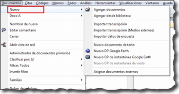

### Agregar documentos a/desde las bibliotecas

Mientras que en las versiones anteriores la opción por defecto de asignación de documentos implicaba únicamente “informar” a ATLAS.ti de la ubicación de los archivos en nuestro ordenador, actualmente el usuario tiene como primera opción ubicar los archivos en *Bibliotecas* de usuario o de equipo, en las que se realiza una “copia” del archivo^[Se creará una copia de los archivos en una carpeta relativamente oculta del ordenador. Aunque es factible acceder a dicha carpeta, recomendamos dejar que que la gestione ATLAS.ti.]. Esa copia pasará a ser el archivo sobre el que se realizará el análisis, es decir, nuestro *Documento Primario*. Esto implica que si eliminamos o modificamos el archivo original (pero no el archivo de la biblioteca), seguiremos teniendo disponible el *Documento Primario*.

Otra característica de los archivos que ubicamos en las bibliotecas, es que sufren algunas modificaciones pues, por ejemplo, son renombrados, de forma que un archivo cuyo nombre original es “Control-Congreso-2011-01-26-00.rtf" puede pasar a llamarse “17190EA4-67B9-4382-A882-298B7C229C14.atldoc” en la versión guardada en la carpeta de la biblioteca. Por último, otra característica fundamental de esos archivos es que no podemos editarlos utilizando nuestro procesador de textos habitual (es decir, no podemos hacer cambios “desde fuera” de ATLAS.ti), lo que evita que podamos realizar cambios accidentales que convertirían el documento en inutilizable por ATLAS.ti. Esto no significa que no podamos realizar modificaciones en los documentos, pero estas tiene que realizarse utilizando las herramientas de edición de documentos propias de ATLAS.ti.

Si optamos por utilizar las bibliotecas, la asignación de archivos a la UH se realizará utilizando la opción Documentos &gt; Nuevo &gt; Agregar documentos (si el documento no ha sido añadido previamente a la biblioteca, es decir, que no lo hemos añadido previamente para utilizar en esta o en otra UH) o bien Documentos &gt; Nuevo &gt; Agregar desde biblioteca (cuando el documento ha sido asignado previamente a alguna de las bibliotecas).

Al utilizar la opción *Agregar documentos*, nos aparecerá una ventana de navegación (figura \ref{fig-agregar-a-biblioteca}) en la que tenemos que seleccionar el/los archivos que queremos convertir en DPs. Por defecto, el programa seleccionará como ubicación de origen la carpeta *Textbank*, pero evidentemente podemos tener ubicados nuestros archivos en cualquier otra parte de nuestro ordenador.

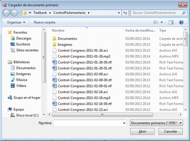

Por su parte, la opción *Agregar desde biblioteca* abrirá una ventana (figura \ref{fig-agregar-desde-biblioteca} ) con la biblioteca de documentos, en la que aparecerán todos los documentos que previamente hayan sido asignados a la *biblioteca*, independientemente de la UH a la que estén asignados. Para la asignación de cualquiera de esos documentos a la UH activa, sólo tenemos que seleccionarlos y hacer clic en *Agregar selección.*

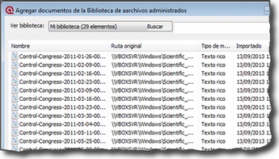

También podemos añadir documentos (a las bibliotecas) arrastrando los archivos desde la carpeta en la que se encuentren (en este caso sin utilizar la opción Documentos &gt; Nuevo, sino desde una ventana de exploración de archivos de Windows hasta a) la lista desplegable de documentos primarios*,* b) el *administrador* de documentos, o c) la ventana principal. Podemos arrastrar, uno o varios documentos e incluso una carpeta entera. En ese último caso se asignarán a la UH todos los documentos contenidos en la carpeta. Pueden arrastrarse múltiples archivos tanto a la lista desplegable como al *administrador* de documentos, mientras que a la ventana principal sólo puede arrastrarse un archivo en cada ocasión.

Para ver los documentos incluidos en nuestras bibliotecas, tenemos que hacer clic en Documentos &gt; Administrador de fuentes de datos &gt; Abrir administrador de biblioteca. En la figura \ref{fig-administrador-biblioteca} podemos ver cómo se nos muestran los documentos existentes en la biblioteca seleccionada (*Mi biblioteca* o *Biblioteca de equipo*) y cómo al seleccionar un documento podemos ver, en la parte inferior izquierda de la ventana la historia de cambios realizados sobre el documento y, en la parte inferior derecha las UH a las que está asignado.

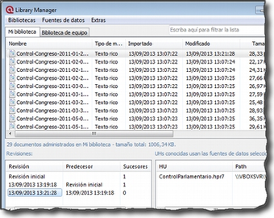

### Asignar archivos externos

También podemos asignar documentos sin que estos pasen a formar parte de la biblioteca —la forma de asignación normal en versiones anteriores del programa. Este tipo de asignación la podemos hacer de dos formas. La primera consiste en utilizar la opción Documentos &gt; Nuevo &gt; Asignar documentos externos (ver figura \ref{fig-añadir-DP}), que abrirá una ventana (ver figura \ref{fig-asignar-externos})^[En la figura aparecen los documentos de la carpeta Textbank > ControlParlamentario, que es donde hemos ubicado nuestros documentos de trabajo. Evidentemente, en el caso de que los tengamos en otra ubicación de nuestro ordenador, tendremos que navegar a la misma.], en la que aparecen los ficheros con las extensiones reconocidas por ATLAS.ti como posibles DPs*.* Para realizar la asignación, únicamente tenemos que seleccionar el/los documentos deseados y hacer clic en *Abrir*.

En el ejemplo de la figura \ref{fig-asignar-externos}, vemos cómo en la ventana *Asignar documentos externos* se muestran únicamente archivos de texto (.rtf) y archivos multimedia (.mp3 y .avi), que son formatos de archivo que pueden asignarse a la UH. Si posteriormente queremos añadir un nuevo DP, como por ejemplo, un archivo de sonido con la grabación de una de las entrevistas, o una nueva transcripción, sólo tenemos que volver a repetir el proceso de asignación seleccionando sólo ese archivo. No es imprescindible, por lo tanto, asignar todos los DPs a la UH antes de empezar a trabajar, podemos asignar nuevos documentos en cualquier momento del proceso de análisis.

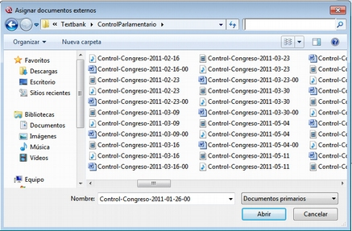

Una vez asignado un documento, para verlo en la pantalla principal de ATLAS.ti bastará con seleccionar su nombre en la lista desplegable de documentos o en el administrador de documentos.

### Documentos incrustados

Aunque tienen características similares a los documentos enriquecidos, mención aparte merece la posibilidad de utilizar documentos creados directamente en ATLAS.ti. En este caso tenemos dos posibilidades, la de crear un nuevo documento de texto que quedará incrustado en la HU, recurriendo a la opción `Documentos &gt; Nuevo &gt; Nuevo documento de texto` (ver \ref{fig-añadir-DP}), o la de utilizar un *Memo* existente como DP. En este último caso, debemos seleccionar un *Memo* creado previamente y utilizar la opción Memos &gt; Miscelánea &gt; Usar como documento primario (ver \ref{fig-memo-como}). Esta última modalidad de los memos como documentos, aunque factible, no es la más recomendable, puesto que implica “duplicar” información como memo y como documento. Esta modalidad resulta prácticamente obsoleta si consideramos la primera, la de documentos incrustados, introducida a partir de la versión 6 de ATLAS.ti.

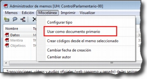

La utilización de este tipo de documentos incrustados puede ser práctica en aquellos casos en que dispongamos de un número limitado de documentos, pues estos estarán incluidos en el archivo .hpr7, lo que facilitará el traslado de la unidad hermenéutica. Por contra, esta opción no será adecuada si queremos utilizar los mismos datos en diferentes análisis (diferentes UHs). Otra ventaja de la opción *Nuevo documento de texto* es que los documentos creados de esta forma son editables, algo que no ocurre con los documentos a partir de memos.

### Encuestas

Si nuestros datos se derivan de las respuestas a preguntas abiertas en una encuesta, podemos utilizar otra estrategia para la asignación de los documentos. En este caso, en vez de utilizar como fuente de datos archivos de texto, tendremos que introducirlos en una hoja de cálculo utilizando un formato especial. Este formato se caracteriza por utilizar determinadas claves para nombrar las columnas —los identificadores de campo— de la matriz de datos, de modo que ATLAS.ti utilice los contenidos de forma distinta. En la figura \ref{fig-hoja-calculo} podemos ver un ejemplo ficticio de datos de este tipo, en el que la primera fila se corresponde con los identificadores de campo y el resto de filas con cada uno de los casos o encuestas. Las tres primeras columnas del ejemplo son datos identificativos de la encuesta, mientras que el resto se corresponden con las preguntas que incluye, tanto abiertas como cerradas. En la conversión de una matriz de datos, cada caso —cada fila— se transforma en un PD incrustado en la UH. Si tenemos 200 casos a nuestra encuesta e importamos la base de datos a ATLAS.ti, el resultado será un conjunto de 200 DP.

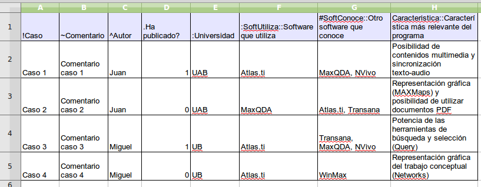

El primer carácter de las etiquetas de la primera fila indica las características de la información que aparece en la columna. De esta forma, en la primera columna la etiqueta !Caso, precedida por el carácter ! indica que la columna se corresponde con cada uno de los casos de encuesta, mientras que el carácter :, que precede a la etiqueta :Universidad en la quinta columna, indica que los datos que encabeza son respuestas a preguntas de elección simple con varias opciones de respuesta. En el cuadro \ref{tabla1} podemos ver el conjunto de identificadores de campos de documento, mientras que en la Tabla aparecen los identificadores de campos de preguntas.

| Carácter | Función |

|:--------:|:--------------------------------------------|

| ! | Identificador de caso (nombre de documento) |

| \~ | Comentario de documento |

| \^ | Autor del documento |

| & | Fecha |

 : Encuestas: Identificadores de campos (documento)\label{tabla1}

El resto de identificadores se corresponden con las preguntas, que pueden ser tanto abiertas como cerradas. En el caso de las preguntas cerradas, estas se importarán como familias (ver Familias en pág. 91) asociadas con los documentos, mientras que las preguntas abiertas serán los “datos” del documento.

| Carácter | Función |

|:--------:|:-----------------------------------------------------------------------------------------------------------------------------------------------------------------------------------------|

| . | Pregunta dicotómica. Los valores posibles son 1/0 (que se corresponden con Sí/No). El nombre de la familia será el mismo que la etiqueta (sin el punto) |

| : | Pregunta de elección simple con más de dos opciones. El nombre de la familia será el mismo que la etiqueta más el valor que se incluya en la celda |

| \# | Pregunta de elección múltiple. Se pueden introducir varios valores separados por coma. El nombre de la familia será el mismo que la etiqueta más los valores que se incluyan en la celda |

 : Identificadores de campos (preguntas cerradas)

Las etiquetas de columna sin prefijo se interpretarán como preguntas abiertas

La importación (asignación) de los datos la realizaremos con la opción Documentos &gt; Nuevo &gt; Importar datos de encuesta (ver Ilustración, pág. Ilustración). De la misma forma que con los documentos incrustados descritos anteriormente, los DPs formarán parte de la UH; estarán incrustados, no vinculados, por lo que no dependerán de lo que hagamos con la hoja de cálculo.

En la figura \ref{fig-datos-encuesta-importados} podemos ver el resultado de la importación de los datos del ejemplo, con los cuatro documentos que se corresponden con los cuatro casos^[El icono de documento incluye un punto verde, lo que nos indica que es un documento incrustado.]. Además de la importación, se crearán familias de documentos en función de las variables de la encuesta.

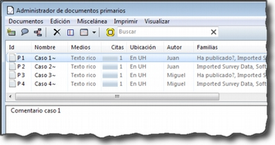

En la figura \ref{fig-encuestas-familias} podemos ver cómo la familia *SoftConoce::MaxQDA* incluye los dos documentos (casos) en los que el valor de la variable es 1 (Sí).

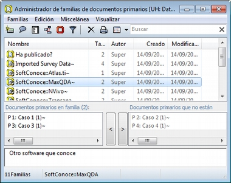

Por último, en la figura \ref{fig-encuestas-DP} podemos ver el documento primario con la pregunta abierta del caso 1.

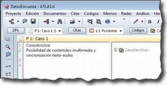

### Comentarios

De nuevo, tal y como hemos hecho con la UH, el siguiente paso, una vez que hemos asignado los DPs, consistirá en añadirles un comentario que permita describirlos en función de las características que sean relevantes para el análisis. Si, por ejemplo, se trata de una entrevista, podríamos incluir información relativa a la(s) persona(s) entrevistada(s), al entrevistador, la fecha de realización, etc. En nuestro caso, incluiremos como la descripción del documento, los parlamentarios participantes y los grupos parlamentarios a los que pertenecen e información sobre los posibles archivos relacionados (ver \ref{fig-comentario-DP}).

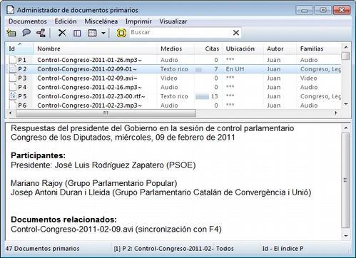

Insistimos en la conveniencia de no obviar este paso, puesto que la documentación es fundamental para la calidad de nuestro análisis. En el caso de los datos, garantizará tener presente en todo momento las características del documento con el que estemos trabajando y, además, facilitará el trabajo en equipo o la posible reutilización de los datos por otros investigadores.

Podemos realizar la edición del comentario de documento con la opción Documentos &gt; Editar comentario (previa selección del mismo en la lista desplegable de documentos) o directamente en el *administrador* de DPs (ver Ilustración). Si usamos el *administrador*, hay que seleccionar el DP a comentar e introducir la información en el campo de texto que ocupa la parte inferior derecha de la ventana.

### Visualización

Una vez que hemos realizado la asignación de los documentos primarios, podemos acceder a ellos desde la lista desplegable de documentos o desde el administrador de documentos.

En el caso de la lista desplegable, la información que aparecerá será la siguiente (figura \ref{fig-lista-DP}):

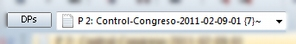

- **Icono** representando el tipo de documento.

- **P n** Donde ***P*** es un identificador (invariable) de *Documento Primario* y ***n*** es el número de orden del documento (orden en que se ha realizado la asignación).

- **Nombre** del documento. A no ser que utilicemos la opción de renombrarlo (Documentos &gt; Nombrar de nuevo), el nombre se corresponderá con el nombre del archivo asignado. Renombrar el documento primario no cambiará el nombre del archivo almacenado en disco.

- **{n}** Número de citas en el documento.

- ***\~*** indica que el documento tiene un comentario.

También podemos visualizar los documentos en el *Administrador de documentos* que, además de mostrarnos información adicional sobre los mismos, nos permitirá acceder a todas las funciones del programa relacionadas con los DPs. En la Tabla podemos ver las informaciones disponibles en el *administrador* de documentos (ver también la figura \ref{fig-comentario-DP})

| | |

|:-----------|:-----------------------------------------------------------------------|

| ID | Icono e identificador del documento |

| Nombre | Nombre del documento |

| Medios | Formato del documento (texto, audio...) |

| Citas | Número de citas del documento |

| Ubicación | Ubicación del archivo (por ejemplo, en *Mi biblioteca*) |

| Autor | Persona que ha realizado la asignación del documento |

| Familias | Familias de DP a las que pertenece el documento |

| Creado | Fecha en que se realizó la asignación del documento |

| Modificado | Fecha de modificación del documento |

| Utilizable | Informa si el documento es accesible o no |

| Origen | Ubicación original desde la que se realizó la asignación del documento |

 : Administrador de documentos primarios: Columnas

### Edición de documentos

Como hemos comentado anteriormente, existe la posibilidad de editar los documentos primarios de texto. Esta opción estará disponible siempre si los hemos asignado a una *biblioteca* o si se trata de documentos incrustados^[1

Los documentos creados con la opción Documentos > Nuevo > Nuevo documento de texto], mientras que si hemos realizado la asignación con la opción *Asignar documentos externos*, sólo será posible la edición para documentos de tipo RTF y TXT.

Si hemos asignado los documentos con la opción *Asignar documentos externos*, recomendamos no realizar ningún tipo de edición salvo en casos de estricta necesidad, puesto que existe la posibilidad de que el documento editado quede inservible y que perdamos nuestro trabajo de análisis. Además, si finalmente decidimos hacer cambios en los documentos, es imprescindible que estos se realicen con las funciones de ATLAS.ti, **nunca** editando el documento con un procesador de texto externo al programa.

### Modo de edición

Para acceder a las funciones de edición de documento, se debe seleccionar en la pantalla principal algún documento que sea susceptible de ser editado. Aparecerá entonces una nueva barra de iconos. El primer icono de la izquierda de la barra es el que permitirá entrar en el modo de edición de documentos (ver \ref{fig-edicion-DP}), salir directamente cuando no hemos realizado cambios (derecha), y salir guardando o cancelando los cambios que hayamos realizado (inferior).

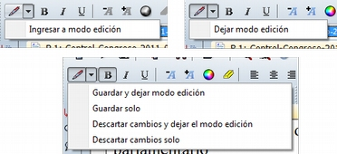

Una vez que hayamos entrado en el modo de edición se activarán las funciones de edición inactivas hasta ese momento (figura \ref{fig-funciones-edicion}).

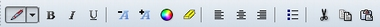

Entonces podemos editar el documento, realizando las modificaciones necesarias, incluyendo borrar o añadir texto, además de las opciones de formato disponibles en la barra de iconos (códigos de negrita, cursiva, subrayado, tamaño de letra...)

### Inserción de objetos/ficheros

De entre las opciones del menú *Edición* destacaremos las de inserción de objeto e inserción de archivo^[Las funciones de inserción también están disponibles en el editor de memos.].

La inserción de archivos (`Edición > Insertar > Insertar archivo...`) permite insertar en el documento que se esté editando, en la posición en la que se encuentre el cursor, cualquier otro documento de formato textual (incluyendo archivos de hojas de cálculo como *Microsoft Excel*). Una vez que el texto ha sido incrustado, pasará a formar parte del DP (evidentemente siempre y cuando guardemos los cambios) y podremos realizar sobre él las mismas operaciones que sobre el resto del documento. Si posteriormente modificamos el archivo que hemos incrustado de esta forma, esos cambios no se reflejarán en el archivo de DP.

Por su parte, la opción de insertar objetos (Edición &gt; Insertar &gt; Insertar objeto...) permitirá incrustar o vincular en el documento primario archivos de prácticamente cualquier formato (imágenes, hojas de cálculo y presentaciones *Power Point* entre otros). De hecho, los formatos posibles vendrán determinados por las posibilidades de nuestro ordenador.

Si seleccionamos esta opción nos aparecerá una­ ventana (figura \ref{fig-insertar-objeto-crear}), con un listado de los diferentes tipos de objetos (archivos) que podemos crear (dependiente de la configuración de nuestro ordenador). Al seleccionar alguno de ellos se abrirá el programa correspondiente y podremos crear un nuevo objeto que quedará incrustado en el DP.

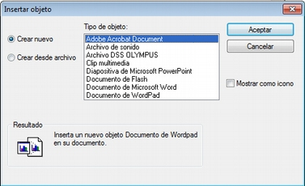

En la Ilustración, podemos observar que está seleccionada la opción *Crear nuevo*, pero también podemos elegir *Crear desde archivo*. Si seleccionamos esa última opción, la pantalla cambiará el formato ( figura \ref{fig-insertar-objeto-desde}), y podremos entonces seleccionar un archivo existente en nuestro ordenador haciendo clic en el botón *Examinar*.

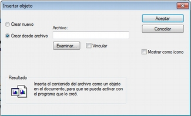

Esa pantalla también nos permite seleccionar (o no) la opción de *Vincular* al objeto existente. Si la seleccionamos, significa que si posteriormente a la vinculación realizamos cambios en el archivo original, éstos quedarán reflejados en el objeto vinculado en el DP; mientras que si no la seleccionamos, el objeto quedará incrustado en el DP y por lo tanto los cambios en el archivo original no quedarán reflejados en el objeto incrustado..

Cualquiera que haya sido la forma de incluir el objeto*,* haciendo doble clic sobre el mismo, podrá editarse utilizando la aplicación original con la que se haya creado. En algunos casos, la edición se realizará en la misma ventana de ATLAS.ti (la pantalla mostrará cambios respecto a su apariencia habitual), mientras que en otros se abrirá el programa adecuado para la edición.

Como hemos visto, tenemos entonces dos formas de incluir información en el documento primario, inserción de texto e inserción de objetos, las diferencias principales entre ellas son dos:

- La inserción de objetos permite incluir tipos de archivos no textuales que además (si hemos escogido la opción vincular) podemos modificarlos externamente a ATLAS.ti de forma que los cambios se actualicen automáticamente.

- Cuando insertamos un **archivo** de texto, podemos realizar sobre el texto insertado el mismo tipo de trabajo de segmentación que haremos habitualmente con nuestros datos, pero el contenido de un **objeto** insertado no puede ser segmentado de la misma forma aunque se trate de un archivo de texto o de imagen, puesto que el programa, al considerarlo un objeto, sólo nos permitirá seleccionarlo como tal, y no podremos acceder a su contenido cuando nos encontremos en “modo segmentación”

Ambas formas de inserción tienen ventajas e inconvenientes, por lo que la decisión sobre cual de ellas utilizaremos dependerá, como en tantas otras ocasiones, de nuestros objetivos. No podemos decir, por lo tanto, que una sea mejor que otra, simplemente que cada una de ellas puede ser más o menos adecuada para nuestros fines.
