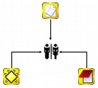

## Familias

ATLAS.ti cuenta con un recurso para crear agrupaciones de elementos atendiendo a los criterios que la analista considere relevantes. Así como los códigos “agrupan” citas, es posible crear agrupaciones de DPs*,* códigos y memos. A estas agrupaciones se les denomina *Familias.* La organización de objetos en familias posibilita un trabajo más ordenado y permite filtrar los elementos con los que se trabaja para una labor más enfocada. En ATLAS.ti no existen familias de citas, puesto que se considera que los códigos ya cumplen esa función. Las familias de ATLAS.ti no son excluyentes entres sí; un mismo objeto puede pertenecer a más de una familia. Para una definición de las familias que un proyecto requiere, es importante considerar la herramienta de S*uper familias* (ver pág. 96), que nos puede automatizar parte del trabajo.

### Tipos de familias

#### Familias de documentos primarios

Podemos agrupar documentos como una forma de organización de los mismos cuando tenemos tipos diferentes de contenidos o cuando los documentos tienen distintas características. Por ejemplo, si nuestro trabajo incluye diferentes modalidades de recogida de información, podríamos agrupar en una familia los documentos con entrevistas individuales, en otra los documentos con entrevistas grupales y en otra diarios de campo. También podríamos, si nuestra investigación incluyera sesiones clínicas con diferentes pacientes, agrupar en familias los documentos correspondientes a las distintas sesiones de un mismo paciente. Por lo general, una buena práctica consistirá en crear tantas familias como criterios hayamos utilizado a la hora de la confección de nuestra muestra.

En el caso de los datos con los que hemos venido trabajando hasta el momento, podemos considerar que las características básicas que diferencian nuestros documentos son:

- Documentos de texto y documentos multimedia.

- Documentos de sesiones de control en el Congreso de los Diputados y de sesiones en el Senado.

- Documentos de la IX legislatura y documentos de la X legislatura.

Podemos por lo tanto utilizar esas características para crear las Familias correspondientes.

#### Familias de códigos

En el caso de los códigos, podríamos igualmente agrupar bajo una misma categoría todos aquellos que según el analista comparten alguna característica.

Anteriormente hemos identificado a cada uno de los participantes autocodificando sus intervenciones y creando un código para cada uno de ellos. Dado que estos participantes tienen diferentes “características” en función de su adscripción política, ahora podríamos agruparlos en función de las mismas, por ejemplo, un primer nivel de agrupación (familia) podría ser en función del partido al que pertenecen, otro nivel podría tener en cuenta si se trata de políticos de izquierdas o políticos de derechas, y también podemos diferenciar entre políticos pertenecientes a partidos de ámbito nacional o de ámbito autonómico, etc. Por último, podríamos crear familias para diferenciar a senadores y congresistas.

Para la creación de estas *familias* de códigos nos hemos basado en códigos “descriptores” de participantes, pero evidentemente podemos realizar el mismo trabajo con los códigos “analíticos”, agrupando aquellos códigos que comparten alguna característica. Por ejemplo, anteriormente habíamos creado códigos que hacían referencia a los diferentes tipos de evasiones en las respuestas (*EvFull*, *EvMedium*, *EvSubstantial* y *EvSubtil*). Dado que todos ellos hacen referencia a modalidades de evasión, podemos crear una familia de códigos *Evasion* que los agrupe.

#### Familias de memos

En el caso de las *Memos*, podemos proceder de la misma forma, agrupándolas en función de sus características. Como hemos visto anteriormente, tenemos la posibilidad de un primer tipo de agrupación (Crear Memos, pág. 36) en función de los tres tipos de categorías de memos disponibles por defecto: comentario, memo y teoría. Aún así la posibilidad de agrupar en familias nos permitirá una mayor flexibilidad a la hora de agrupar diferentes tipos de memos. Podríamos, por ejemplo, crear familias de memos en función de la sección de un reporte en la que se ubicarían sus contenidos (e.g. método, resultados, discusión, etc.).

### Creación de familias

La creación/edición de las familias se realiza mediante la opción *Familias* de los menús *Documentos*, *Códigos* y *Memos* (figura \ref{fig-menu-administrador-familias}), que nos permitirá acceder a su vez a las opciones *Abrir administrador de familias* y *Asignar familias* .

La opción *Abrir administrador de familias* abrirá una ventana (figura \ref{fig-administrador-familias}) en la que podremos realizar prácticamente todas las acciones relacionadas con las familias: creación, visualización, edición, etc. La primera acción a realizar será la creación de familias. Para ello, en el menú *Familias* seleccionaremos la opción *Nueva familia* y daremos un nombre a la nueva familia que deseamos crear. Como podemos ver en la Ilustración, la ventana *Administrador de familias* nos presenta

- Una zona (1) en la que aparece la lista de las familias existentes,

- los elementos (en este caso documentos) asignados a la familia seleccionada (2), y los no asignados a esa familia (3).

- La asignación o de-asignación de un elemento a la familia seleccionada, que podemos realizar con los botones de dirección (5 y 6). Si seleccionamos un documento en (3) y hacemos clic en el icono &lt; ese código pasará a formar parte de la familia seleccionada, mientras que si seleccionamos un documento en (2) y hacemos clic en el icono &gt;, el código dejará de ser miembro de la familia. La asignación también puede realizarse haciendo doble clic en alguno de los elementos no asignados (3). De la misma forma, podemos de-asignar un elemento haciendo doble clic sobre él (2).

- También encontramos un campo de texto en la zona inferior de la ventana en el que podemos editar los comentarios de las familias (4).

- Finalmente, en la parte superior de la ventana encontramos las diferentes opciones de menú junto con una barra de iconos.

En la figura \ref{fig-asignar-familias} podemos observar cómo hemos creado las familias de documentos que comentábamos anteriormente: Audio, Texto y Vídeo (en función de las características del archivo), Congreso y Senado (en función de la cámara en la que se realiza la sesión) y Legislatura IX y Legislatura X (en función de la legislatura correspondiente)

Si ya hemos creado alguna familia, una forma alternativa de manipularla es mediante la segunda opción a la que tenemos acceso desde el menú Familias &gt; Asignar familias*.* Aunque como podemos ver en la Ilustración la ventana es similar al *Administrador de familias,* en este caso en (1) tenemos la lista de documentos (mientras que anteriormente se visualizaba la lista de familias existentes), y en (2) y (3) las familias en las que está incluido o no el elemento seleccionado (documentos en el caso del *Family Manager*). En la ilustración podemos ver que el documento P2 está asignado a las familias *Congreso*, *Legislatura IX* y *Texto*. Por lo tanto, si ahora seleccionamos una familia de las que aparecen en (2) y hacemos clic en el icono con la flecha de dirección derecha (4), el documento seleccionado dejará de estar asociado con la familia que hayamos elegido.

Como hemos podido comprobar, la lógica de ambos procedimientos es diferente. En el primer caso, *Administrador de familias,* se opera sobre las familias: podemos añadir o eliminar elementos a una familia y visualizar los integrantes de la misma. En el segundo caso, *Asignar familias,* se opera sobre los objetos (documentos en nuestro ejemplo), pues podemos visualizar y editar para cada uno su pertenencia a determinadas familias.

Una forma alternativa de crear familias de documentos es utilizando la opción Documentos &gt; Nuevo &gt; Importar datos de encuesta. Aunque como vimos anteriormente (Encuestas, pág. 48) esta opción tiene como finalidad importar datos de encuesta (y por lo tanto crear nuevos DPs), podemos utilizarlo también cuando tenemos una UH con documentos ya asignados. La única diferencia con la importación anterior es que en la hoja de cálculo tenemos que especificar como nombres de documentos los ya existentes en la UH y que no incluiremos preguntas abiertas, sólo las preguntas cerradas que darán paso a la creación de familias de documentos. Este tipo de importación podría realizarse también con la opción *Importar tabla de familias de DPs*, disponible en el menú *Familias* del administrador de familias, pero el formato de datos es mucho más “amigable” con la opción para datos de encuesta.

#### Súper familias

Volviendo al administrador de familias, en la barra de iconos cabe resaltar el correspondiente a la herramienta *Súper familia*, que permitirá crear un nuevo tipo de familias utilizando operadores lógicos en la combinación de familias ya existentes. La mecánica de su creación es similar a la utilizada en la herramienta *Consultas*, por lo que para los detalles sobre cómo crearlas remitimos al apartado dedicado a dicha herramienta (pág. 147).

En la figura \ref{fig-super-familias} podemos ver la *Herramienta de Súper familia*, en el momento de la creación de una súper familia de documentos para aquellos que cumplen la condición de estar asignados a la familia *Congreso* **y** a la familia *Legislatura IX*.

Con nuestros datos, parece evidente que, ya que tenemos familias de documentos de sesiones del Congreso y del Senado y familias de documentos de dos legislaturas diferentes, también deberíamos agrupar por un lado los documentos del Congreso de la IX Legislatura y por otro los de la X legislatura. Esto podemos hacerlo creando la familia y realizando la asignación “a mano”, o utilizando esta herramienta de creación de *súper familias*. Aparte del menor esfuerzo necesario para su creación, las *súper familias* tienen la ventaja de que se actualizarán de forma automática cuando un documento cumpla la condición lógica a partir de la que se han creado. Es decir, si hemos creado la *super familia* “Congreso **y** Legislatura IX” especificando que sus miembros serán todos aquellos documentos que cumplan la condición lógica de formar parte de la familia *Congreso* **Y** de la familia *Legislatura IX*, si posteriormente a su creación un nuevo documento cumple esa condición (asignamos un nuevo documento a nuestra UH y lo vinculamos con ambas familias), pasará automáticamente a formar parte de la super-familia creada anteriormente.

En la figura \ref{fig-super-familias-DP} podemos ver cómo hemos creado cuatro *súper familias* a partir de la combinación de las familias *Congreso*, *Senado*, *Legislatura IX* y *Legislatura IX*.

De la misma forma que creamos *súper familias* de documentos podemos crear *súper familias* de códigos, por ejemplo la *súper familia* *Nacionales* en la que se incluirán los partidos de ámbito nacional y la *súper familia* *Autonómicos*, en la que se incluirán los partidos de ámbito autonómico. En este caso, la creación de la *súper familia* seguirá una estrategia diferente, puesto que lo que haremos será “combinar” mediante el operador lógico “O” a los diferentes partidos políticos (recordemos que los partidos son familias de códigos cuyos miembros son los diferentes parlamentarios). En el caso de la *súper familia* *Nacionales*, la sintaxis de nuestra *Consulta* sería:

(((("IU" | "PCE") | "PP") | "PSOE") | "UPD")

Podemos proceder de la misma forma para crear las *súper familias* *Izquierda* y *Derecha*, y finalmente podríamos crear una *súper familia* *Nacionales-Derecha* con la combinación mediante el operador “Y” de las *súper familias* *Nacionales* y *Derecha*.

### Trabajar con familias

Una vez que hemos creado los diferentes tipos de familias, podemos utilizarlas como una forma fácil y rápida de **filtrar información**, es decir, de seleccionar para su visualización sólo aquellos elementos que pertenezcan a una familia en concreto. Por ejemplo, podemos aprovechar la posibilidad que nos ofrece el programa de aplicar diversas modalidades de filtros, en este caso en función de las familias, para activar única y exclusivamente los documentos relacionados con la familia *Congreso*, o los códigos relacionados con la familia *Nacionalistas.* Para ello, tendremos que recurrir a la opción *Filtrar* en cada uno de los menús *Documentos*, *Citas* y *Códigos*, y buscar la familia correspondiente en la opción *Familias.* Como vemos en la figura \ref{fig-administrador-DP-filtro}, una vez aplicado un filtro por familia de documentos (*Senado*), en el administrador de documentos sólo aparecen los 7 documentos relacionados con dicha familia. En la barra de estado se indica también (2) que el filtro activado es el da la familia Senado^[Siempre que se haya activado un filtro de cualquier tipo, la visualización del administrador sepresentará con un fondo de color amarillo pálido en vez del blanco usual.].

Cuando nuestra UH incluye una gran cantidad de información (e.g. cientos de Pds o de códigos) puede ser práctico aplicar este tipo de filtros simplemente para visualizar en el administrador o en la lista desplegable sólo una parte de dicha información. Por ejemplo, puede ser práctico en determinados momentos no visualizar el conjunto de documentos primarios de la UH, sino sólo los documentos con sesiones del Senado. Para ello se aplicaría un filtro de familia que deje fuera a los documentos con otros contenidos, siempre y cuando hayamos creado previamente las familias en cuestión y asignado los PDs a las que les correspondan.

Sin embargo, la utilidad de los filtros por familia va mucho más allá, sobre todo si tenemos en cuenta que aplicar un filtro implica que todas las acciones que se realicen posteriormente se aplicarán única y exclusivamente a los elementos activos. Por ejemplo, si aplicamos el filtro anterior (familia de documentos “Senado”), esto afectará al número de citas que visualizaremos en el administrador de citas; no se mostrarán aquellas pertenecientes a los documentos que han sido excluidos por el filtro. Por lo tanto, si ahora solicitamos un informe (ver Informes en pág. 181) de todas las citas de la UH, éste sólo incluirá las citas activas con el filtro en uso.

Podemos operar de la misma forma con las familias de códigos, aunque la activación de filtro por familia de códigos no afecta a la visualización del administrador de citas. Las familias de códigos pueden ser utilizadas como filtros para visualizar únicamente los códigos relacionados con una familia. Podemos visualizar, por ejemplo, sólo los códigos relacionados con la familia de códigos *Evasion*. En la figura \ref{fig-administrador-codigos-filtro} podemos ver el resultado: la visualización de cuatro códigos (1) por la activación del filtro de familia *Evasión* (2).

Si antes de la aplicación del filtro pedimos un listado de las citas de **todos** los códigos utilizando la opción del menú Códigos &gt; Imprimir &gt; Todos los códigos con citas*,* el resultado será un listado de las citas del conjunto de códigos de la UH, mientras que si realizamos la misma operación con posterioridad a la aplicación del filtro el resultado será un listado de las citas de los cuatro códigos de la familia *Evasión*, puesto que en ese momento esos son **todos** los códigos de la Unidad Hermenéutica.

También podemos visualizar las citas correspondientes a los códigos incluidos en una familia seleccionando, en el *Administrador de familias de códigos*, la familia de interés y, posteriormente, la opción Familias &gt; Imprimir y aceptando la sugerencia *¿Incluir citas en la impresión?*. Esta es una forma fácil y rápida de visualizar las citas correspondientes a un conjunto de códigos que comparten alguna característica relevante en el análisis. Por ejemplo, si queremos un listado de las citas de los políticos pertenecientes a un mismo partido, sólo tenemos que seleccionar la familia correspondiente y pedir el listado.

Otra ventaja de la activación del filtro de códigos es que nos permite realizar el trabajo de codificación de una forma más cómoda, ya que podremos centrarnos en un conjunto limitado de códigos.
