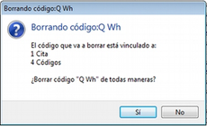
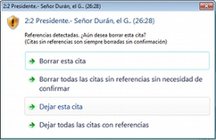
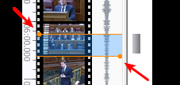
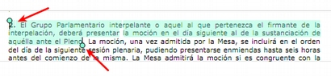
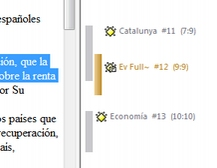
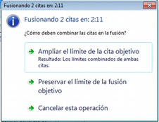
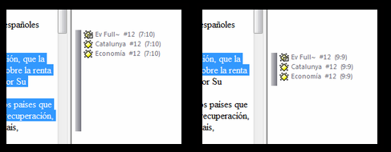
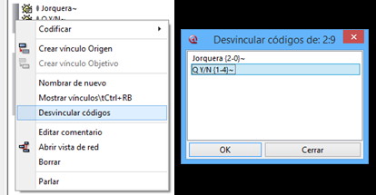

## Operaciones sobre citas y códigos

### Eliminar citas y códigos

Podemos eliminar tanto citas como códigos haciendo clic en el icono  del administrador correspondiente. Las citas también podemos eliminarlas desde el menú contextual que aparece al hacer clic sobre el texto de la cita o la barra de cita en la pantalla principal. Si la cita está relacionada con algún código o con otra cita —cita no libre— se nos pedirá confirmación antes de eliminarla definitivamente (figura \ref{fig-confirmacion-eliminar-cita}).

Hay que ser extremadamente cauteloso a la hora de realizar esta tarea, puesto que a la fecha, en ATLAS.ti no es posible deshacer una acción de este tipo.

En el caso de los códigos ocurrirá lo mismo, se nos pedirá confirmación si el código tiene algún tipo de relación con citas, con otros códigos, o con cualquier otro objeto (figura \ref{fig-confirmacion-eliminar-codigo}).

### Modificar extensión cita

Si queremos modificar una cita ya existente cambiando su punto de inicio y/o final, tenemos que

1) Seleccionar la cita en la lista desplegable de citas o haciendo clic en la barra vertical de cita, desde el margen derecho.

2) Modificar la selección, es decir, seleccionar el nuevo texto que queremos que quede asignado a esa cita.

3) Hacer clic en el icono  de la barra de iconos de documento o en la opción *Modificar tamaño de la cita* del menú *Citas*.

Este procedimiento lo utilizaremos tanto para los documentos de texto como para las imágenes.

 Para los documentos de audio o vídeo, el procedimiento es similar, pero en esta ocasión el segundo paso, la modificación de los límites de la cita, lo realizaremos desplazando las barras limitadoras (figura \ref{fig-modificacion-multimedia}). Finalmente, como podemos ver en la figura \ref{fig-modificacion-pdf}, procederemos de una forma similar con los documentos de tipo PDF.

### Fusionar citas

Además de modificar la extensión de una cita, en ocasiones también querremos unir varias citas en una única, pues podemos considerar, por ejemplo, que la segmentación original ha sido excesivamente específica. El proceso implicará, en primer lugar, seleccionar la cita que queremos conservar (la cita *objetivo*) y a continuación utilizar la opción Citas &gt; Miscelánea &gt; Fusionar citas. En la siguiente secuencia de ilustraciones, vemos que partimos de tres citas que, además, están relacionadas con un código diferente cada una de ellas. Nuestro objetivo es fusionar la cita \#11, codificada como *Catalunya* y la \#13, codificada como *Economía*, en la cita \#12, codificada como *Ev Full*. Al seleccionar la cita \#12 (figura \ref{fig-fusionar-destino}) y hacer clic en *Fusionar citas* nos aparecerá una nueva ventana con el resto de citas del DP. Una vez hemos seleccionado las citas a fusionar, tendremos que decidir la forma de fusión en la ventana emergente (figura \ref{fig-fusionar-modalidad}).

Las opciones que tenemos son *Ampliar el límite de la cita objetivo* y *Preservar el límite de la fusión objetivo*. En la Ilustración vemos los resultados de ambas opciones. A la izquierda vemos que el resultado de *ampliar* es una única cita, la \#12, cuyos límites se han ampliado para incluir el texto de las citas \#11 y \#13. En la parte derecha de la figura \ref{fig-fusionar} vemos cómo el resultado de *preservar* sigue siendo una única cita, pero en esta ocasión el texto que incluye es el original de la cita objetivo. En ambos casos los códigos con los que estaban relacionados las citas \#11 y \#13 pasan a estar asociados con la cita objetivo.

### Fusionar códigos

El proceso de depuración puede implicar también la necesidad de fusionar códigos. Esto puede deberse a que en la primera ronda de codificación hayamos creado códigos demasiado específicos y posteriormente consideramos que para nuestros objetivos puede ser suficiente con un código más genérico.

Imaginemos, por ejemplo, que hemos decidido codificar todas las intervenciones en que aparece alguna referencia a relaciones internacionales entre España y otros países y que, en un primer momento hemos optado por crear diferentes códigos, uno para cada país al que se haga referencia, y que tenemos, por lo tanto códigos del tipo *RI-Francia*, *RI-Italia*, *RI-EEUU*, etc. Si posteriormente consideramos que en el caso de los países europeos es suficiente con diferenciar entre aquellos que son miembros de la Unión Europea y los que no, podemos optar por fusionar los códigos necesarios en un nuevo código *RI-UniónEuropea*. Para ello utilizaremos la opción Códigos &gt; Fusionar códigos.

Como podemos ver en la figura \ref{fig-fusion-comentario}, una vez realizada la fusión, el código resultante incorporará una notificación de la fusión realizada así como los comentarios de los códigos fusionados. La notificación de la fusión sólo aparece cuando los códigos que se fusionan contienen comentarios.

### Desvincular cita/código

En ocasiones podemos querer “descodificar”; es decir, eliminar la relación entre una cita y un código. Esto nos puede interesar bien porque hayamos cometido un error al codificar o bien porque en el proceso de depuración de los códigos decidamos que es mejor eliminar esa relación.

En esos casos, tenemos dos opciones. Si la cita está relacionada única y exclusivamente con un código y no queremos mantenerla como tal, podemos proceder simplemente a eliminar la cita como veíamos anteriormente. Pero si queremos mantener la cita y eliminar únicamente la relación con el código, sea porque la misma cita está codificada por otros códigos o por otra razón, la acción a realizar es la de *Desvincular códigos*, accesible desde el menú contextual de la barra de cita, en el margen derecho (figura \ref{fig-desvincular}, izquierda). Al activar esta opción, aparecerá una ventana con los códigos con los que esté relacionada la cita (figura \ref{fig-desvincular}, derecha) y podemos elegir entonces desvincularla de todos o algunos de ellos. Podemos realizar el mismo proceso desde el menú contextual accesible en la etiqueta de código al lado de la barra de cita, pero con esta opción no se nos pedirá confirmación.

